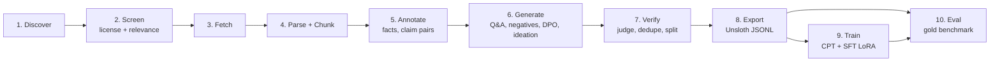
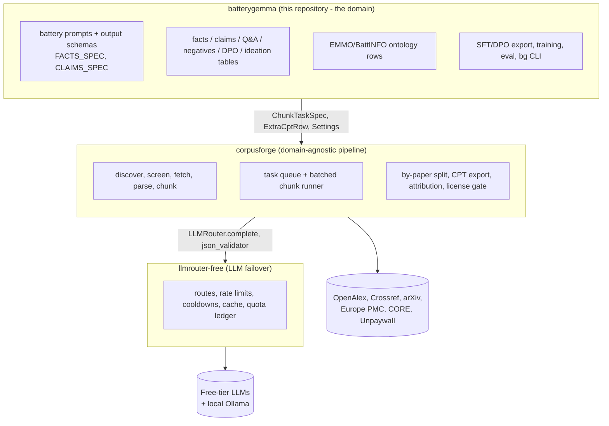
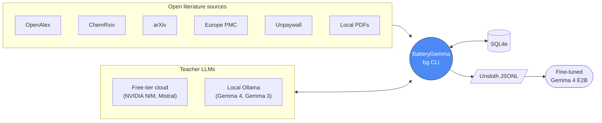
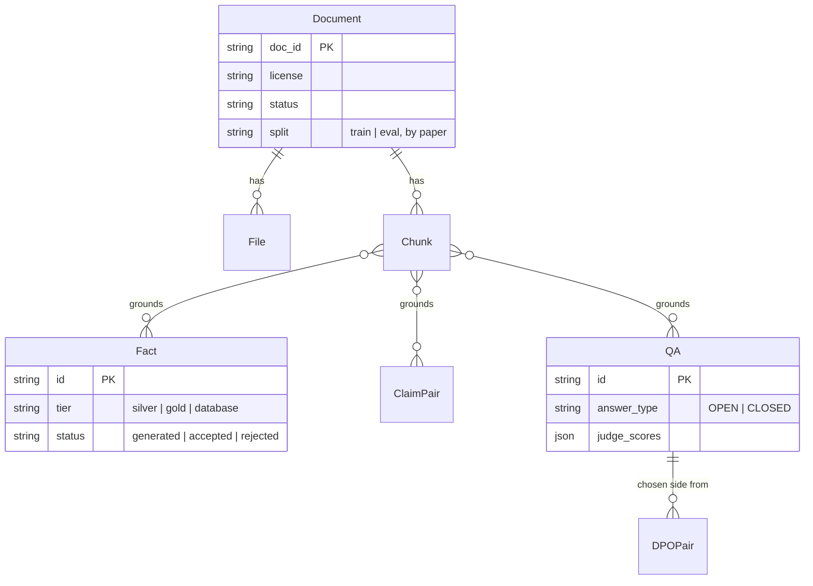
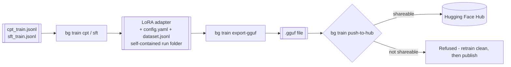

# BatteryGemma

**Turning open lithium-ion battery literature into a fine-tuned expert model.**

Inspired by [MedGemma](https://developers.google.com/health-ai-developer-foundations/medgemma), BatteryGemma
asks the same question for a different domain: can a small, open model become a genuinely useful research
assistant if it's fine-tuned on real domain literature instead of general text? This repo is the full
pipeline that gets from "a pile of open-access battery papers" to "a fine-tuned Gemma 4 E2B that reasons like
a battery materials scientist" — and, just as importantly, a benchmark that can actually tell you whether it
worked.

Everything here runs on a single Apple Silicon laptop, on free-tier APIs, with no CUDA and no cloud training
budget. That constraint shaped a lot of the design.

BatteryGemma is the **domain layer** of a three-repository system: it sits on two reusable packages that were
extracted from it - [`llmrouter-free`](https://github.com/fredbuildsai/llmrouter-free) (a quota-aware LLM failover
router for free-tier providers) and [`corpusforge`](https://github.com/fredbuildsai/corpusforge) (a domain-agnostic
open-literature-to-corpus pipeline). See [How the three projects fit together](#how-the-three-projects-fit-together).

For the full arc42 architecture writeup (building blocks, runtime views, decision log, risks), see
**[docs/architecture/README.md](docs/architecture/README.md)**. For training/GGUF/publishing specifics, see
**[docs/training.md](docs/training.md)**; for how license safety is enforced end-to-end, see
**[docs/licensing.md](docs/licensing.md)**. This README is the shorter "why and how."

---

## Pain points this solves

| Pain point | What this project does about it |
|---|---|
| **A domain-specific LLM needs domain-specific training data, and building that dataset by hand doesn't scale.** | An end-to-end pipeline from raw literature to layered training data (raw text → facts → Q&A/negatives/DPO/ideation), with generation quotas and balance ratios encoded in config so "enough data" is a defined target, not a guess. |
| **You can't fine-tune a public model on whatever text you find — licensing is not optional.** | A three-checkpoint license gate (export → train → a hard block at publish) with a machine-checkable attribution manifest tracing every training row back to its source DOI and license. Caught a real incident during this project's own build: two copyrighted books that had already leaked thousands of rows into the training set — see [docs/licensing.md](docs/licensing.md). |
| **"Fine-tune an LLM on a Mac" mostly means following CUDA-oriented docs that quietly don't apply.** | Real, live-verified findings about Unsloth's MLX (Apple Silicon) backend — which model checkpoint format actually avoids a 16GB memory wall, why `FastLanguageModel` isn't a different code path here, why GGUF export always dequantizes first — written up in [docs/training.md](docs/training.md) instead of left to be re-discovered. |
| **Free-tier LLM APIs rate-limit constantly at real pipeline scale**, and a naive integration just stalls or crashes. | [`llmrouter-free`](https://github.com/fredbuildsai/llmrouter-free): a router with per-provider cooldowns, automatic failover across an ordered deployment chain, and a local Ollama fallback for when every cloud option is exhausted at once. |
| **A multi-hour pipeline run *will* get interrupted** (crash, sleep, Ctrl-C) — restarting from scratch wastes hours and paid/rate-limited API calls. | Every stage is a resumable job queue keyed by a stable idempotency key; re-running the same command after an interruption reprocesses only what wasn't finished. |
| **Config drift between machines** — "works on my machine" because nobody wrote down what "my machine" actually has. | `bg init` scaffolds a fresh project (all config YAMLs, `.env`, data directories, migrated DB) in any directory; every training run additionally snapshots its own exact config + dataset into its own self-contained output folder. |

---

## Why

Foundation models are broad but shallow on any one scientific domain. Battery materials science is exactly
the kind of field where that shows: mechanisms matter, units matter, and "it depends on the cathode chemistry
and cutoff voltage" is a real answer, not hedging. The MedGemma project showed that grounding a small model in
a domain's actual literature — not just prompting a big model with RAG at inference time — produces a model
that *thinks* in the domain's terms. This project applies the same recipe to lithium-ion batteries:

1. Collect openly-licensed battery-science literature.
2. Turn it into layered datasets: raw text (for continued pretraining), then structured facts, then
   instruction-style Q&A, contrastive negatives, preference pairs, and grounded research ideation.
3. Fine-tune Gemma 4 E2B on it.
4. Actually measure whether the fine-tuned model got better — on a held-out benchmark, not just training loss.

A recurring theme throughout the build was: **don't trust a stage until it's been run against real data and
produced real, inspectable output.** Several "should obviously work" pieces of code turned out not to,
under real load — a few of those stories are below, because they explain why the code looks the way it does.

---

## What it actually does



| Stage | What happens |
|---|---|
| **Discover** | Query OpenAlex, ChemRxiv, arXiv, Europe PMC, plus locally-supplied PDFs, with cross-source deduplication. |
| **Screen** | License allowlist (CC0/CC-BY/public-domain by default) + keyword relevance scoring. |
| **Fetch** | Europe PMC XML first, then the licensed PDF, then an Unpaywall repository mirror as fallback. Bot-protected sources (Cloudflare, Radware, WAFs) are **detected and left alone, never bypassed**. |
| **Parse + Chunk** | JATS XML or Docling-parsed PDF → cleaned, section-aware chunks (~600 tokens, ≤10% overlap) with a garble-ratio quality filter. |
| **Annotate** | An LLM extracts structured facts (material → property → value → unit, with the evidence sentence) and claim pairs (paraphrase/contradiction) from each chunk. |
| **Generate** | From chunks + facts: instruction Q&A, multi-turn conversations, false-premise/contradiction negatives, DPO preference pairs, and grounded research ideation — at quotas large enough to be statistically meaningful, not a handful of hand-picked examples. |
| **Verify** | A judge model from a **different model family** than the generator scores faithfulness/correctness; near-duplicates are removed; documents are split train/eval **by paper**, so no paper's content appears on both sides. |
| **Export** | Unsloth-ready JSONL: `cpt_{train,eval}.jsonl`, `sft_{train,eval}.jsonl`, `dpo_{train,eval}.jsonl`. |
| **Train** | LoRA fine-tuning of Gemma 4 E2B via Unsloth's MLX backend — on Apple Silicon, no CUDA. |
| **Eval** | A held-out gold benchmark (closed/open Q&A, negative-detection, ideation) built exclusively from eval-split papers, scored with real accuracy metrics and confidence intervals — not just loss. |

---

## How the three projects fit together



| Project | Role | Install |
|---|---|---|
| [`llmrouter-free`](https://github.com/fredbuildsai/llmrouter-free) | Calls LLMs reliably on free tiers: ordered failover, per-provider rate limits and cooldowns, response cache, daily-quota ledger, structured-output helpers. Knows nothing about papers or batteries. | `pip install "llmrouter-free @ git+https://github.com/fredbuildsai/llmrouter-free.git@v0.1.0"` |
| [`corpusforge`](https://github.com/fredbuildsai/corpusforge) | Turns open literature into a licensed, chunked corpus and runs any per-chunk LLM stage resumably: discovery, license/relevance screening, full-text fetch, parsing, task queue, splitting, CPT export with per-row attribution. Knows nothing about batteries. | `pip install "corpusforge[parse] @ git+https://github.com/fredbuildsai/corpusforge.git@v0.1.0"` |
| `batterygemma` | Everything battery-specific: what to extract and how to prompt for it, the fact/claim/Q&A tables, the ontology, the cross-family judge, SFT/DPO datasets, training, evaluation. | this repository |

`bg discover|screen|fetch|images|add-local|parse|fetch-failures|pipeline-failures|blacklist*` and `bg logs` are
corpusforge's commands, registered on `bg` unchanged - so the workflow below is the same as before the split. The
same commands exist as `corpusforge <command>`, which is what a *new* domain would use. The design rationale (and
the verification that the split changed nothing) is [ADR-013](docs/architecture/09-architecture-decisions.md#adr-013-split-into-three-packages).

---

## System context



Cloud teacher models are tried first; when every free-tier deployment is rate-limited at once (which happens
in practice at full-corpus scale), the router falls through to a local Ollama model rather than stalling.

---

## How it's built — a few decisions that mattered

These aren't hypothetical design notes — each came from something that actually broke.

- **A real SQLite deadlock, found and fixed.** Early versions let a caller's open database session call into
  an LLM-extraction function, which itself opened another session to log the API call. Two overlapping
  writers on the same SQLite file don't queue politely — they deadlock. Every resumable pipeline step now
  takes a bare `Engine` and manages short, fully-committed sessions around the LLM call instead, with **no
  transaction ever left open while waiting on a network call.**

- **Rate limits are a first-class failure mode, not an edge case.** At the scale of 10,000+ text chunks, free
  cloud APIs *will* all rate-limit at once. The router treats "temporarily blocked" and "gone for good"
  differently, cools down shared provider budgets as a group, and — as of this project — falls back to a
  **local Ollama model** as a last resort, so a rate-limit storm degrades throughput instead of halting the
  pipeline. (That local fallback had its own bug: Ollama's Gemma models are "thinking" models, and left alone
  they'd either return empty answers or take 3 minutes per call. `think: false` fixed both.)

- **Every pipeline stage is resumable by construction.** A job queue table (keyed by
  `"<task_type>:<chunk_or_row_id>"`) means killing a multi-hour run halfway through and re-running the same
  command is always safe — nothing gets duplicated, nothing gets lost. This was verified directly, not
  assumed: after two overlapping partial runs, a check for duplicate rows across every affected table came
  back clean.

- **Statistical adequacy was a design requirement, not an afterthought.** Early manual review of a prior
  prototype found that "4 or 5 generated examples" tells you nothing. Generation quotas, positive/negative
  balance ratios, and minimum sample sizes for human audit (≥385 items per dataset type, for a ±5% confidence
  interval) are all encoded in config, not left to judgment calls at generation time.

- **Bot protection is never bypassed.** Several sources (Wiley, RSC, MDPI, ScienceDirect, IOP/JES) actively
  block scraping. Those failures are detected, logged with the actual reason, and left alone — recovery only
  ever goes through legitimate channels (e.g. an Unpaywall-indexed author repository copy of the same paper).

- **Training on Apple Silicon meant finding Unsloth's real MLX behavior, not its CUDA docs.** Three
  incompatibilities were found only by actually running training: Gemma 4 E2B loads as a vision model by
  default (fixed by forcing text-only), response-only loss masking needs a conversational dataset shape (not
  pre-rendered text), and the built-in chat template lacks the markers that masking mechanism needs on this
  backend (a known, documented limitation — SFT currently trains on the full sequence, not just the answer).
  A fourth was found choosing *which* Gemma 4 E2B checkpoint to actually load: the obvious full-precision repo
  reproducibly hung the whole machine 3 times before a single training batch ran, at ~19GB combined memory on
  a 16GB laptop — fixed by switching to Unsloth's own pre-quantized MLX checkpoint. See
  [docs/training.md](docs/training.md).

- **License enforcement can't be a single filter at ingestion — it has to catch documents that skip
  ingestion entirely.** Two commercial, copyrighted books had been added directly for local research use and
  had already leaked thousands of rows into the exported training data before an attribution manifest made
  it visible. The fix is a three-checkpoint gate (warn-and-offer at export and train time, hard refusal only
  at publish time) with per-row source traceability, not a one-time check. See [docs/licensing.md](docs/licensing.md).

See **[docs/architecture/](docs/architecture/README.md)** for the full decision log (15 ADRs), the data model, and
sequence diagrams for the resumable-task, LLM-failover, training-chain, and license-gate patterns.

---

## Data model, at a glance



Every generated row carries its source `doc_ids`/`chunk_ids`, license, split, generator model, and judge
scores — full provenance, end to end, from source paper to training example.

---

## Getting started

### One command

```bash
git clone https://github.com/fredbuildsai/batterygemma && cd batterygemma
scripts/setup.sh                 # venv + llmrouter-free + corpusforge (from GitHub) + batterygemma + `bg init`
source .venv/bin/activate
```

`scripts/setup.sh` checks for Python 3.11/3.12 and git, installs [`uv`](https://docs.astral.sh/uv/) if it is missing,
creates `.venv`, installs the two packages from their pinned GitHub tags (PyPI later), installs BatteryGemma editable,
and scaffolds the project. It is safe to re-run. Options:

| Option | Effect |
|---|---|
| `--dev` | Clone `../llmrouter-free` and `../corpusforge` and install all three **editable** - for working across repositories. |
| `--with-train` | Also install the Unsloth training extra (Apple Silicon MLX backend; large). |
| `--no-parse` | Skip the parsing extras (Docling pulls PyTorch; needed for `bg parse` only). |
| `--skip-init` | Do not run `bg init` at the end. |
| `--python 3.11` | Choose the Python version (default 3.12). |
| `--dry-run` | Print every command instead of running it. |

`LLMROUTER_REF` / `CORPUSFORGE_REF` override which tag or branch is installed.

### Manual install

```bash
uv venv && source .venv/bin/activate
uv pip install "llmrouter-free @ git+https://github.com/fredbuildsai/llmrouter-free.git@v0.1.0" \
               "corpusforge[parse] @ git+https://github.com/fredbuildsai/corpusforge.git@v0.1.0"
uv pip install -e ".[dev,parse,dedupe]"
bg init                           # scaffolds configs/, .env, data/output dirs, and the database
```

(`uv sync --extra dev --extra parse --extra dedupe` also works from a checkout that has the sibling repositories next to
it: `pyproject.toml` maps both packages to `../llmrouter-free` and `../corpusforge` for development.)

`bg init` is safe to re-run any time — it reports what already exists rather than touching it (`--force` to
overwrite). It also works in a completely empty directory: `configs/`, `.env`, `data/`, and a migrated
database are created relative to wherever you run it, not wherever the package happens to be installed (see
[ADR-012](docs/architecture/09-architecture-decisions.md#adr-012-project_root-is-the-working-directory-not-the-package-install-location)).

### Upgrading a database created before the split

Before the split a single Alembic history covered every table. If you have such a database, run once:

```bash
bg db adopt-split                 # backs up, verifies every table/column, records the new baselines; changes no data
```

It refuses (with advice) if the schema does not match, and is a no-op if already adopted
([ADR-014](docs/architecture/09-architecture-decisions.md#adr-014-independent-schemas-and-migration-histories-bg-db-adopt-split)).
On the reference corpus (1,010 documents, 9,030 chunks, ~25k facts) every row count matched afterwards and all exported
JSONL files and attribution manifests were byte-identical to the pre-split export.

Fill in at least one free-tier LLM API key in the generated `.env`, then work through the pipeline stage by
stage:

```bash
uv run bg discover
uv run bg screen
uv run bg fetch --limit 500
uv run bg parse --limit 500
uv run bg annotate facts
uv run bg annotate claims
uv run bg generate qa
uv run bg generate negatives
uv run bg generate dpo
uv run bg generate ideation
uv run bg judge qa
uv run bg judge ideation
uv run bg export --version v0.1
uv run bg eval build-gold
```

`bg stats` and `bg llm status` are your friends at any point — the first shows row counts and document
breakdowns, the second shows per-provider quota usage and cooldown state.

Run the test suite with:

```bash
uv run pytest        # ~190 tests here; llmrouter-free and corpusforge carry their own suites (~75 and ~235)
```

---

## Training and publishing

```bash
uv run bg train cpt data/export/v0.1/cpt_train.jsonl          # continued pretraining
uv run bg train sft data/export/v0.1/sft_train.jsonl           # supervised fine-tuning
uv run bg train export-gguf outputs/sft                        # merge + quantize to GGUF
uv run bg train push-to-hub outputs/sft/gguf --repo-id you/batterygemma-sft
uv run bg eval run data/eval/gold_v1.jsonl --model outputs/sft
```



Every training run is self-contained (its exact config and dataset are copied into its own output folder)
and license-checked *before* training starts, not just at the end — full detail, examples, and the memory-
hang story behind the default model choice in **[docs/training.md](docs/training.md)**. Publishing is the
one hard gate in the whole pipeline: a model trained on any non-open-licensed material cannot be pushed to
Hugging Face until retrained without it — see **[docs/licensing.md](docs/licensing.md)**.

## Status

Stages 1-11 (discover through eval) are built and tested, including LoRA training (CPT + SFT), GGUF export,
and a license-gated Hugging Face publish flow. Not yet built or not yet reliable: DPO training itself (needs
a CUDA machine — Unsloth's MLX backend doesn't support `DPOTrainer`), response-only SFT loss masking (needs a
``-annotated Gemma 4 chat template), CPT→SFT adapter chaining (diverges to NaN loss — CPT-only
and SFT-only both train cleanly), and cross-paper-cluster ideation (currently single-chunk). See
[docs/architecture/ § Risks and Technical Debt](docs/architecture/11-risks-and-technical-debt.md) for the
full list.

## License

MIT. See [LICENSE](LICENSE).
