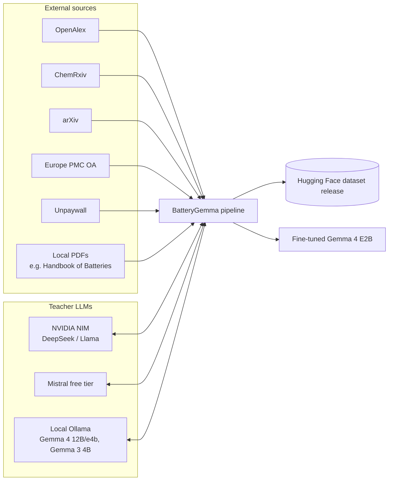
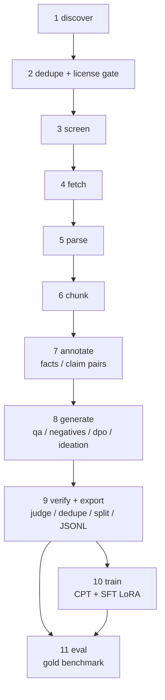
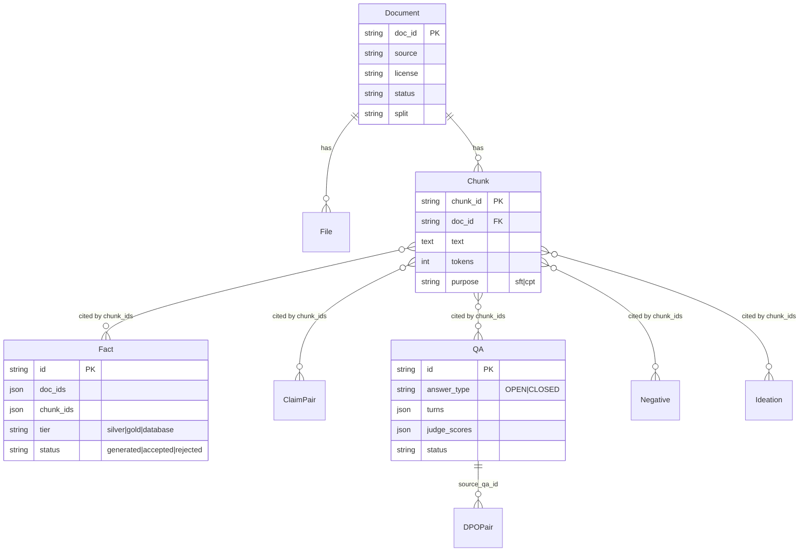
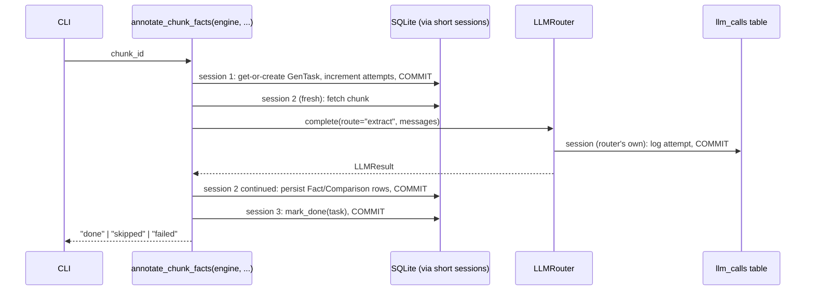
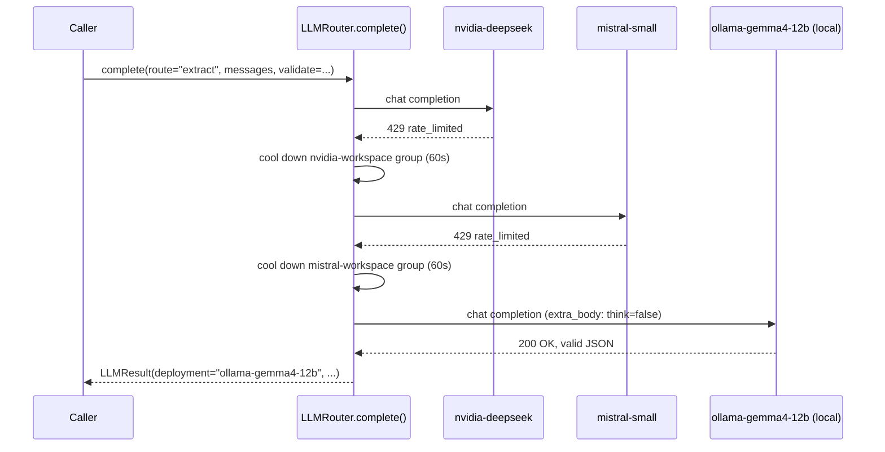
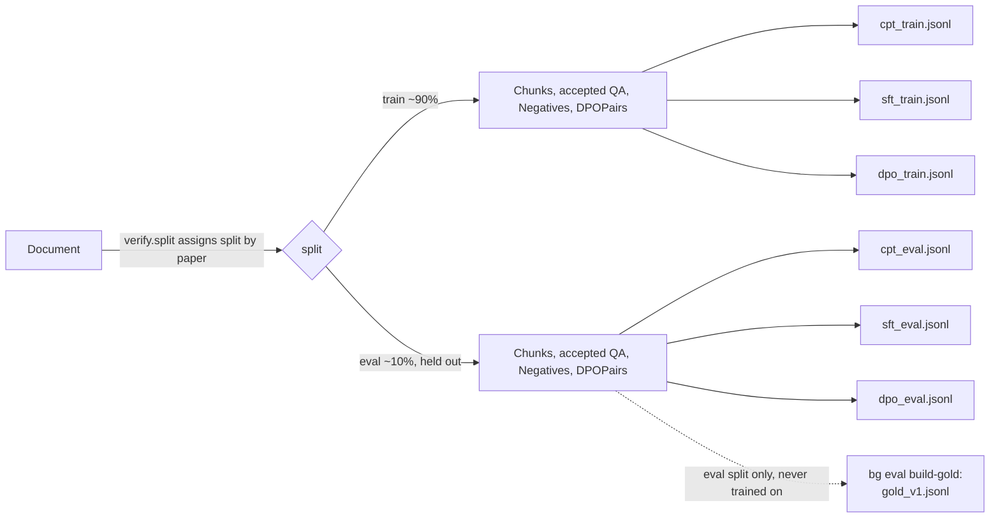
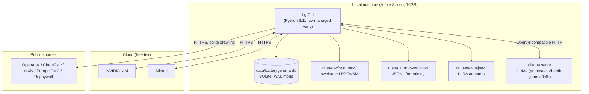

# BatteryGemma — Architecture Documentation (arc42)

Status: reflects the codebase as of branch `m1-ingestion`, through training/GGUF export/the license-gated
Hugging Face publish flow and the `bg init` portability work. This document describes what is actually built
and running, not the aspirational plan — where a planned feature is not yet implemented, it is marked
**[planned]**.

For deep dives this document only summarizes, see **[docs/training.md](training.md)** (training on Apple
Silicon, GGUF export, publishing) and **[docs/licensing.md](licensing.md)** (the license gate, in full, with
the real incident it caught).

---

## 1. Introduction and Goals

### 1.1 Requirements overview

BatteryGemma turns openly-licensed lithium-ion battery literature into fine-tuning datasets, and fine-tunes
Gemma 4 E2B (via Unsloth) to act as an expert battery materials scientist: able to answer technical questions
grounded in the literature, correct false premises, and propose testable research ideas.

Concretely, the system must:

1. Discover and collect open-access (and, optionally, licensed-but-non-redistributable) battery-science
   documents from multiple sources.
2. Extract clean, section-aware text chunks with full provenance (document, license, section).
3. Derive structured annotations (facts, comparisons, contradiction/paraphrase claim pairs) from those chunks
   using teacher LLMs.
4. Generate training data in multiple formats — continued-pretraining text, instruction Q&A, multi-turn,
   negatives (false-premise/contradiction/insufficient-evidence), DPO preference pairs, and grounded ideation
   — at a volume large enough to be statistically meaningful, with an enforced positive/negative balance.
5. Verify generated data with an independent judge model, deduplicate it, and split it by source paper into
   train/eval so no paper leaks across the split.
6. Export Unsloth-ready JSONL and fine-tune Gemma 4 E2B locally.
7. Evaluate the fine-tuned model against a held-out gold benchmark with real accuracy metrics, not just
   training loss.

### 1.2 Quality goals

| # | Quality goal | Motivation / scenario |
|---|---|---|
| 1 | **Correctness of licensing** | Every document's license is evaluated before its text can reach an export; the default HF-releasable export must never include a paper whose license disallows redistribution. |
| 2 | **Statistical adequacy of generated data** | Early manual review found "4 or 5 examples" is not remotely enough to draw conclusions; every dataset type needs both a generation quota (`configs/generation.yaml`) and a human-audit sample size large enough for a defensible confidence interval (≥385 items, ±5% at 95%). |
| 3 | **Resumability / no lost work** | The pipeline processes tens of thousands of chunks against free-tier, rate-limited APIs; any stage must be interruptible and resumable without reprocessing or duplicating completed work. |
| 4 | **No silent data leakage across train/eval** | Splits are assigned per source document, not per generated row, so a paper's chunks, facts, Q&A, and eval-benchmark items never appear on both sides. |
| 5 | **No bypassing of bot protection** | A hard policy: fetch failures caused by Cloudflare/Radware/WAF challenges are recorded and left alone, never circumvented. |
| 6 | **Reliability of the teacher-LLM layer** | At full-corpus scale, free-tier cloud rate limits are real (confirmed: up to ~70% task failure in bursts); the router must fail over automatically, including to a local model, rather than stall the pipeline. |
| 7 | **Honesty of "done"** | Every stage's correctness is checked with unit tests against real bugs (not just written and assumed), and, where feasible, with a live run against real data before being reported as working. |

### 1.3 Stakeholders

| Role | Concern |
|---|---|
| Project owner (sole user/operator) | Wants a working pipeline they can run end-to-end on their own machine (Apple Silicon, 16GB) without paid infrastructure, and a fine-tuned model that is actually useful. |
| Future maintainer (could be the same person, later) | Needs to understand *why* the code is shaped as it is — several parts exist specifically because an earlier, simpler version had a real bug. |

---

## 2. Constraints

### 2.1 Technical constraints

| Constraint | Detail |
|---|---|
| Local hardware | Apple Silicon (M1, 16GB unified memory). No CUDA. Training runs through Unsloth's MLX backend (`mlx-lm`), not the standard CUDA/bitsandbytes path. |
| Model | Gemma 4 E2B, specifically `unsloth/gemma-4-E2B-it-UD-MLX-4bit` — Unsloth's own pre-quantized MLX checkpoint. This exact repo was chosen only after two other variants reproducibly failed on this hardware; see [ADR-009](#adr-009-mlx-model-selection-through-three-real-failures) and [docs/training.md](training.md#the-model-matters-more-than-the-code). A small multimodal model, loaded via `text_only: true` (a config key, not a hardcoded constant — see ADR-009) for the plain-text path. |
| Budget | Free-tier LLM APIs only by default (`BG_ALLOW_PAID=false`); a small paid budget (`BG_MAX_USD_PER_DAY`) is available but unused so far. |
| Storage | SQLite today; the ORM uses only portable SQLAlchemy types so the same schema can later point at Postgres/Supabase via `BG_DATABASE_URL` with no code change. |
| Licensing | Default dataset export must be restricted to CC0/CC-BY/public-domain (with CC-BY-SA flagged), because the intent is a public Hugging Face release. `bg add-local` still accepts any local PDF regardless of license for personal research use, but a document's license is enforced at three further checkpoints (export, train, and a hard block at publish) — see [ADR-010](#adr-010-license-gate-the-hard-block-is-at-publish-not-at-gguf-export) and [docs/licensing.md](licensing.md). |
| Filesystem | The repository must live outside iCloud Drive sync (see ADR-001) — this is an environment constraint discovered the hard way, not a design choice. |
| Portability | `bg` resolves `configs/`/`data/`/`outputs/`/`.env` relative to the current working directory (`PROJECT_ROOT = Path.cwd()`), not to wherever the package is installed — `bg init` scaffolds a fresh project in any folder. See [ADR-012](#adr-012-project-root-is-the-working-directory-not-the-package-install-location). |

### 2.2 Organizational constraints

- Single-developer project; no CI pipeline beyond local `pytest`.
- No dedicated ML infra — training, inference, and the whole data pipeline run on the same laptop.

---

## 3. Context and Scope

### 3.1 Business context



### 3.2 Technical interfaces

| Interface | Protocol | Notes |
|---|---|---|
| OpenAlex, ChemRxiv, arXiv, Europe PMC, Unpaywall | HTTPS REST/JSON | polite crawling: contact-email User-Agent, per-host interval, retry/backoff (`sources/base.py::PoliteClient`) |
| LLM providers (NVIDIA NIM, Mistral) | OpenAI-compatible chat completions via LiteLLM | `llm/router.py` |
| Local Ollama | OpenAI-compatible chat completions via LiteLLM's `ollama_chat/` provider, `http://localhost:11434` | no API key; used as a rate-limit-proof fallback (ADR-006) |
| Unsloth / mlx-lm | in-process Python (no network) | `train/sft.py`, `eval/run_eval.py` |
| CLI | `bg <command>` (Typer) | the only user-facing interface; no web UI or API server |

---

## 4. Solution Strategy

| Goal | Strategy |
|---|---|
| Handle tens of thousands of LLM calls against free, rate-limited APIs | A quota-aware router (`llm/router.py`) with per-deployment/rate-group cooldowns, automatic failover across an ordered chain of deployments, response caching by prompt hash, and — as of the current design — a local Ollama deployment appended to every chain as a last-resort, no-rate-limit fallback. |
| Never lose progress on a multi-hour, interruptible pipeline | Every annotate/generate/judge operation is wrapped in a resumable task (`annotate/tasks.py`, `GenTask` table) keyed by a stable idempotency key (`"<task_type>:<chunk_or_row_id>"`); re-running a stage is always safe. |
| Avoid the "same model grades its own homework" problem | The judge route explicitly excludes the generator's model family (`exclude_families`); cross-family judging is preserved even under fallback (see ADR-007). |
| Keep the schema portable beyond SQLite | SQLAlchemy 2.0 declarative models restricted to portable column types (`String`, `Text`, `Integer`, `Float`, `Boolean`, `JSON`, `DateTime`) plus Alembic migrations. |
| Produce statistically meaningful data, not a handful of examples | `configs/generation.yaml` encodes explicit per-chunk/per-paper/per-cluster generation quotas, balance ratios (positive/negative, closed yes/no, claim-pair paraphrase/contradiction), and minimum per-cell coverage targets, checked by `bg stats`. |
| Prove each stage actually works | Every stage has unit tests built around a real bug found while building it (see §9), and — where practical — a live smoke run against real corpus data before being called done. |
| Train on Apple Silicon without CUDA | Delegate to Unsloth's internal MLX backend rather than assuming the CUDA path; three real incompatibilities (VLM default load path, `assistant_only_loss` dataset shape, missing chat-template `` markers) were found and worked around via live runs, documented in `train/sft.py`'s module docstring. |

---

## 5. Building Block View

### 5.1 Level 1 — pipeline stages (whitebox of the overall system)



Stages 1-3 and parts of 4 are combined behind `bg discover`/`bg screen`/`bg fetch`; 5-6 behind `bg parse`; 7-9
are separate CLI command groups (`annotate`, `generate`, `judge`, `export`) so any one can be re-run
independently and resumed. `local` documents (user-supplied PDFs) enter directly at the "fetched" state via
`bg add-local`, skipping discover/screen/fetch.

### 5.2 Level 2 — module map

```
src/batterygemma/
  cli.py                 Typer entry point; every `bg <command>` maps 1:1 to a function here.
                          Includes `init` (project scaffolding) and the license-gate orchestration
                          (`_check_license_before_training`, `_materialize_run_folder`, `_retrain_clean`)
                          — deliberately kept in the CLI layer, not the library modules, since it's
                          interactive-prompt/orchestration logic, not core pipeline logic.
  settings.py             .env / pydantic-settings. Two distinct roots (ADR-012): PACKAGE_ROOT (where
                          batterygemma itself is installed - alembic scripts, .env.example, templates/)
                          vs. PROJECT_ROOT (Path.cwd() - configs/data/outputs/.env for the CURRENT project)
  templates/               bundled default config YAMLs `bg init` copies into a fresh project's configs/

  db/
    models.py             SQLAlchemy 2.0 ORM: Document, File, Chunk, Material,
                           Fact, Comparison, ClaimPair, QA, Ideation, Negative, DPOPair,
                           LLMCall, GenTask, Release
    session.py             get_engine() / get_session() / migrate(); WAL + busy_timeout pragmas

  sources/                 one adapter per discovery source (openalex, arxiv, crossref, local),
    base.py                 PoliteClient: rate limiting, retries, bot-protection detection
    store.py                cross-source dedupe + upsert into `documents`

  screen/
    license.py              license allow/flag/deny evaluation
    screening.py             keyword relevance scoring (with Unicode-dash normalization)

  fetch.py                  XML (Europe PMC) > licensed PDF > Unpaywall mirror, in that order

  parse/
    jats.py, pdf_docling.py  format-specific text extraction
    clean.py                 boilerplate/garble removal
    chunk.py                 section-aware, token-budgeted chunking with bounded overlap
    pipeline.py              glue: parse_and_chunk()

  annotate/                 stage 7 — base layer (facts, claim pairs)
    facts.py, claim_pairs.py, grounding.py, tasks.py (resumable-task helpers)

  generate/                 stage 8 — derived layer (qa, negatives, dpo, ideation)

  verify/                   stage 9 — judge, dedupe, split
    judge.py, dedupe.py, split.py

  export/
    unsloth_jsonl.py         writes {cpt,sft,dpo}_{train,eval}.jsonl + a per-file `AttributionManifest`
                              (`*.attribution.json`: doi/doc_id -> {license, title, chunks: [row indices]})
    licensing.py              the license gate (ADR-010): classify_export(), restricted_doc_ids_for_file(),
                              write_filtered_jsonl(), LICENSE_STATUS.json read/write
    hf_release.py             model-card generation + the actual Hugging Face upload (push_gguf_to_hub)

  train/                    stage 10
    environment.py            ensure_unsloth() — installs the `train` extra on demand
    data.py                   JSONL -> HF `datasets.Dataset`
    sft.py                    run_cpt() / run_sft() via Unsloth's MLX backend; load_or_apply_lora()
                              (fresh LoRA, or --from-adapter continuation via mlx_lm's load_adapters);
                              export_gguf() / export_gguf_from_adapter() (merge + quantize to GGUF)

  eval/                     stage 11
    build_gold.py             held-out benchmark from split="eval" documents
    run_eval.py               generation + scoring against the benchmark
    metrics.py                Wilson-interval accuracy aggregation

  llm/
    router.py                 LLMRouter: failover, cooldowns, caching, cost budget
    schemas.py                 pydantic output schemas for every LLM JSON contract
```

### 5.3 Data model (entity overview)



`Fact`, `Comparison`, `ClaimPair`, `QA`, `Ideation`, `Negative`, `DPOPair` all share two mixins:
**`ProvenanceMixin`** (`doc_ids`, `chunk_ids`, `license`, `split`, `generator_model`, `judge_scores`, `tier`,
`status`, `reject_reason`, `human_checked`) and, for the derived-layer tables, **`StratifiedMixin`**
(`task_format`, `polarity`, `question_type`, `component`, `chemistry`, `grounding`) — the labels the balancing
planner and export filters key off.

`Chunk.doc_id` is a real foreign key to `Document`, but every annotation/generation row stores `doc_ids`/
`chunk_ids` as JSON lists rather than foreign keys, because several row types (multi-doc synthesis Q&A,
ideation) are grounded in more than one chunk or document at once.

---

## 6. Runtime View

### 6.1 Scenario: resumable chunk annotation (the SQLite-deadlock-avoidance pattern)

This is the most consequential runtime pattern in the codebase (see ADR-003). Every `annotate_chunk_*` /
`generate_*` / `judge_one_*` function follows the same three-phase shape, taking an `Engine` rather than a
`Session` so it can open and close short-lived sessions around the one long-running step (the LLM call):



No session is ever left open with pending writes while the LLM call is in flight — the router logs to
`llm_calls` via its *own* independent session concurrently, and two overlapping SQLite writers on the same
file without this discipline deadlock rather than queue (confirmed by reproduction before the fix).

### 6.2 Scenario: teacher-LLM call with failover



If every deployment is only *temporarily* blocked, the router sleeps in bounded increments up to
`max_wait_seconds` (default 120s) before giving up with `AllDeploymentsExhausted`; a deployment that returns
an auth or "not in your tier" error is disabled outright rather than retried.

### 6.3 Scenario: export and train/eval split integrity



Every exported row's split is inherited from its source `Document.split`, never assigned independently — this
is what prevents one paper's content from leaking across train/eval, and it is also why the stage 11 gold
benchmark (`eval/build_gold.py`) only draws from `split == "eval"` documents: it is drawing from the same
papers already excluded from training, not a separate mechanism.

---

## 7. Deployment View

There is exactly one deployment environment: the developer's own Apple Silicon Mac.



No containerization, no orchestrator, no CI/CD deploy step — `uv run bg <command>` is the entire runtime.
Long stages are launched as background shell scripts (`scripts/*.sh`) writing timestamped logs under
`data/logs/`, watched interactively.

---

## 8. Cross-Cutting Concepts

### 8.1 Licensing and provenance

Every `Document` carries `license` + `license_evidence` (the concrete signal that produced the license
classification, e.g. "chemrxiv API: license.name"). `screen/license.py` evaluates it against an allow/flag
list (`configs/sources.yaml`: `license_allow: [CC0, CC-BY, public-domain]`, `license_flag: [CC-BY-SA]`) before
a document can be accepted. Every derived row inherits `license` from its source document(s) so the export
stage can filter by license without re-deriving it.

### 8.2 The resumable-task pattern

Formalized in `annotate/tasks.py`: `get_or_create_task(session, task_type, key)`, `mark_done`, `mark_failed`,
backed by the `gen_tasks` table (`key` is unique — `"<task_type>:<id>"`). Every annotate/generate/judge
operation checks this before doing any LLM work and updates it after, so `bg annotate facts`, `bg generate
qa`, etc. can be re-run at any time (a partially completed pipeline is a normal state, not an error state).

### 8.3 The LLM router's failure taxonomy

`_classify_error()` in `router.py` maps every provider exception into one of: `auth`/`unavailable`
(disabling — stop trying this deployment this session), `rate_limited`/`quota` (cooldown, shared across a
`rate_group`), or `error` (short cooldown, e.g. transient 5xx/timeout). This taxonomy is what lets the router
distinguish "try again later" from "never try this one again" without hardcoding provider-specific logic at
every call site.

### 8.4 Grounding checks

`annotate/grounding.py::overlap_ratio`/`is_grounded` — a word-overlap heuristic (not exact match) between
generated text and its source chunk, used as a cheap sanity filter before a more expensive judge call, and
as the sole quality gate for `Negative` rows (which have no judge step — see §8.6).

### 8.5 Judge independence

`verify/judge.py` always excludes the generator's model family from the judge route
(`exclude_families=[_family_of(qa.generator_model)]`), so a model never grades its own output. When only one
family is actually available, `allow_same_family_fallback=True` permits a same-family fallback but marks the
result `relaxed_family=True` so the weaker independence is recorded, not hidden. `_family_of()` is a
best-effort heuristic on the stored model-id string (`rsplit("/", 1)[-1].split("-")[0]`) rather than an exact
stored field — a known, documented simplification.

### 8.6 Two-tier acceptance: judged vs. grounding-only

Not every generated row goes through the judge:

| Row type | Quality gate |
|---|---|
| `QA` | LLM judge (`faithfulness≥4, correctness≥4, specificity≥3`) → `status=accepted/rejected` |
| `Ideation` | LLM judge (`groundedness≥4, correctness≥4, novelty≥3, feasibility≥3`) |
| `Negative` | Grounding check only at generation time; stays `status=generated` forever (no judge step exists) — `export_sft` deliberately filters on `"generated"`, not `"accepted"`, for this table (a real bug once filtered on `"accepted"` and silently exported zero negatives). |
| `DPOPair` | Built only from already-`accepted` `QA` rows, so its `chosen` side is always judge-verified by construction. |

### 8.7 Local-model fallback and its own failure modes

Ollama-hosted Gemma models are *thinking* models. Two real failure modes were found and fixed (ADR-006):
leaving `think` enabled either burns the token budget on `reasoning_content` and returns empty `content` (at
a small `max_tokens`), or takes 150-180s+ per call (at a larger budget) — both broke the pipeline differently.
`extra_body: {think: false}` disables reasoning outright, fixing both at once (~30-70s/call, confirmed live).

### 8.8 Testing philosophy

Every module pairs with a test file that encodes a *specific, previously real* failure — not just a happy-path
smoke test. Examples: the SQLite deadlock reproduction, the `FalsePremiseOut` empty-string-vs-null validation
gap, the `export_sft` negatives-status filter bug, the `_family_of()` three-segment model-id bug, the fetch
`httpx.TransportError` crash. New code is expected to follow the same pattern: find the real bug via a live
call or a close reading, then write the test that would have caught it.

---

## 9. Architecture Decisions

Recorded as lightweight ADRs — decision, context, consequence — in chronological order.

### ADR-001: Move the repository out of iCloud Drive
- **Context**: `import batterygemma` intermittently failed after `uv sync`.
- **Decision**: relocate the repo from `~/Documents/...` (iCloud-synced) to `/Users/fred/code/batterygemma`.
- **Reason**: iCloud sets the BSD `hidden` flag on synced `.venv/.../*.pth` files, and CPython 3.11.15 skips
  hidden `.pth` files when building `sys.path`, silently breaking the editable install.
- **Consequence**: any future clone must live outside an iCloud-synced folder.

### ADR-002: Always pass the full extra set to `uv sync`
- **Context**: `uv sync --extra train` silently uninstalled `docling`/`pytest` installed by a previous
  `--extra parse` call — `uv sync` defines the *complete* extra set for that invocation, it does not add to
  the existing one.
- **Decision**: `train/environment.py::ALL_EXTRAS` lists every extra together; `ensure_unsloth()` always syncs
  all of them at once.
- **Consequence**: adding a new optional extra means adding it to `ALL_EXTRAS`, not just `pyproject.toml`.

### ADR-003: Resumable task wrappers take an `Engine`, never a caller's open `Session`
- **Context**: the original design let a caller's session (with pending writes) call into
  `annotate_chunk_facts`, which internally called `router.complete()` — which opens its *own* session to log
  to `llm_calls`. Two overlapping SQLite writers on the same file deadlock rather than queue; reproduced with
  the literal "database is locked" error, then a full hang once `busy_timeout` alone was added (proving
  genuine deadlock, not simple contention).
- **Decision**: every resumable wrapper (`annotate_chunk_facts`, `annotate_chunk_claims`, `annotate_chunk_qa`,
  `annotate_chunk_false_premise`, `annotate_chunk_ideation`, `annotate_qa_dpo`, `judge_one_qa`,
  `judge_one_ideation`) takes an `Engine` and manages 2-3 short-lived, fully-committed sessions with no
  transaction left open across the LLM call.
- **Consequence**: `register_sqlite_pragmas()` (WAL + `foreign_keys` + `busy_timeout=30000`) was extracted into
  `db/session.py` and is applied by both `get_engine()` and the test fixture — the test fixture previously
  built a bare engine with none of these pragmas, a related bug.

### ADR-004: Two dataset-licensing tracks, default CC/open-only
- **Context**: the plan called for both a public-releasable dataset and a broader one including
  commercially-licensed or non-redistributable sources (e.g. the locally-supplied Handbook of Batteries PDF).
- **Decision**: default export path is CC0/CC-BY/public-domain only (for the public HF release); a second
  path may include everything, for local fine-tuning only, never public export. **[the second path's
  dedicated CLI flag is planned, not yet implemented — export currently filters by license implicitly via
  what documents were accepted at screen time, not via an explicit `--include-commercial` switch]**
- **Consequence**: `bg add-local` accepts any local PDF regardless of license, but license-based export
  filtering must be revisited before that flag is built.

### ADR-005: Router failover taxonomy and shared rate groups
- **Context**: providers return heterogeneous error shapes for "try again later" vs. "never usable" vs.
  "daily quota gone," and several models from one provider (e.g. every Mistral model) draw on one shared
  workspace budget.
- **Decision**: `_classify_error()` normalizes provider exceptions into `auth`/`unavailable` (disable),
  `rate_limited`/`quota` (cooldown, shared per `rate_group`), `error` (short cooldown, per-deployment).
- **Consequence**: adding a new provider only requires getting its error shapes right in this one function.

### ADR-006: Local Ollama as a rate-limit-proof fallback, with `think: false`
- **Context**: at full-corpus scale (10k+ chunks), all free-tier cloud deployments in a route were observed
  hitting rate limits simultaneously, exhausting the router's retry budget (~30-70% task failure in bursts on
  `annotate claims`/`annotate facts` — confirmed in `data/logs/full-run-20260914-073925.log`).
- **Decision**: added `ollama-gemma4-12b`, `ollama-gemma4-e4b`, `ollama-gemma3-4b` (via `ollama_chat/` and
  `http://localhost:11434`, no API key) to the end of every route, tried only after cloud options are
  exhausted.
- **Complication found and fixed**: these are Ollama "thinking" models. With thinking on, they either return
  empty `content` (small `max_tokens` — the whole budget goes to `reasoning_content`) or take 150-180s+ per
  call (larger budget) — both broke the pipeline differently. `extra_body: {think: false}` fixed both
  (confirmed live: ~30-70s/call, populated `content`).
- **Consequence**: local inference is slower per-call than an unthrottled cloud call, but has no rate limit;
  it is deliberately ordered last so cloud is preferred when available.

### ADR-007: Judge-route family exclusion survives local fallback
- **Context**: `ollama-gemma4-e4b` shares a model family (`gemma4`) with `ollama-gemma4-12b`, which can also
  serve as the *generator's* fallback — naively adding both to the judge route risked the same-model-grades-
  itself problem exactly when both routes fall back to local models simultaneously.
- **Decision**: both share `family: gemma4` in config; the router's existing `exclude_families` mechanism
  correctly skips `ollama-gemma4-e4b` as a judge when the generator used `ollama-gemma4-12b`, falling through
  to `ollama-gemma3-4b` (a genuinely different family) instead.
- **Consequence**: no special-case code was needed — the existing exclusion mechanism generalized correctly,
  confirmed by reasoning through the config rather than by asserting it.

### ADR-008: Fetch and parse network errors must not crash the whole stage
- **Context**: `_try_pdf_url()` only caught `BlockedByBotProtection` and `httpx.HTTPStatusError`; a genuine
  network error (`httpx.ReadTimeout`, confirmed live) propagated uncaught and crashed the entire `bg fetch`
  loop after only 4 of 452 documents, rather than failing just that one document.
- **Decision**: catch `httpx.TransportError` at every network call site in `fetch.py`, returning/recording a
  `network_error` outcome and continuing to the next document/URL.
- **Consequence**: `bg fetch` is now robust to transient connectivity issues mid-run; regression tests added
  (`test_network_error_on_pdf_url_does_not_crash_and_falls_back_to_unpaywall`, and the no-fallback case).

### ADR-009: MLX model selection through three real failures
- **Context**: Unsloth's documentation is CUDA-first; following its obvious recipe on Apple Silicon degrades
  silently into memory thrashing rather than a clean error. Three model repos were tried, live, in order:
  `unsloth/gemma-4-E2B-it` (full precision) hung reproducibly 3 times at the identical point in loading — `top`
  showed state `stuck`, ~19GB combined resident+compressed memory on a 16GB machine, confirmed independent of
  `max_seq_length` (2048 vs 1024 made no difference, proving the spike is load-time, not sequence-length).
  `unsloth/gemma-4-E2B-it-GGUF` looked like the fix but, per direct inspection of the installed `unsloth_zoo`
  source, this Unsloth version's MLX backend only *exports* to GGUF — no load path exists for training.
- **Decision**: use `unsloth/gemma-4-E2B-it-UD-MLX-4bit` (Unsloth's own MLX-native, pre-quantized checkpoint).
  Confirmed live: no runtime quantization pass at load (`'...' is already quantized` in the log), 574MB
  resident after LoRA setup vs. multi-gigabyte for the full-precision path at the same point.
- **Related finding**: on this backend, `FastLanguageModel` (Unsloth's CUDA-oriented API name) is not a
  different code path — `unsloth/__init__.py` aliases `FastLanguageModel = FastModel = FastTextModel`, all
  delegating to the same `FastMLXModel`. There is no CUDA/bitsandbytes path to fall into on Apple Silicon.
- **Consequence**: `configs/train_cpt.yaml`/`train_sft.yaml`'s `model_name` carries this entire finding as an
  inline comment, so nobody re-discovers it by re-running the same three failures. Full narrative and a
  diagram: [docs/training.md](training.md#the-model-matters-more-than-the-code).

### ADR-010: License gate — the hard block is at publish, not at GGUF export
- **Context**: two commercial, copyrighted books had been added via `bg add-local` (which accepts any local
  PDF for personal research use) and had already contributed thousands of rows to the exported training data
  — invisible until the attribution manifest (below) was built and read. An earlier version of this gate
  refused to even *produce* a GGUF file from an adapter trained on such material; explicit user feedback
  mid-build corrected this: local artifacts for personal use are legitimate, only *redistribution* isn't.
- **Decision**: three checkpoints warn and offer to fix it (`bg export`, `bg train cpt|sft` before training
  starts, and an informational warning in `bg train export-gguf`); exactly one, `bg train push-to-hub`,
  refuses outright. Every export and training run writes `LICENSE_STATUS.json` recording `shareable` plus
  enough `training_provenance` (stage, config, dataset path) to retrain clean automatically when blocked.
  Classification reuses `screen/license.py::evaluate_license` against the same allow/flag lists ingestion
  uses, so a document's status is judged identically at every checkpoint.
- **Consequence**: an adapter with a missing `LICENSE_STATUS.json` (e.g. one trained before this feature
  existed) is treated as unverified, not as safe-by-default — `push-to-hub` refuses it the same as a
  known-restricted one, until retrained under the current gate. Full walkthrough with the real incident:
  [docs/licensing.md](licensing.md).
- **Related fix found in the same pass**: `bg blacklist`'s own docstring says it never touches already-
  generated content — but the export functions never checked `Document.blacklisted` at all, so a document
  blacklisted for *any* reason (not just this) still leaked its content into every export. Fixed by the same
  change: every export now excludes blacklisted documents unconditionally.

### ADR-011: Self-contained per-run training folders
- **Context**: `outputs/cpt/`'s only record of what produced it was "whatever `configs/train_cpt.yaml`
  happened to contain at the time" — a file that gets edited for the next run. There was no way to know, six
  months later, what config or exact dataset a given adapter actually came from.
- **Decision**: every `bg train cpt|sft` run copies its exact resolved config (`config.yaml`) and exact
  training data (`dataset.jsonl`, `dataset.attribution.json`) into its own output directory, and
  `LICENSE_STATUS.json`'s `training_provenance.dataset` is updated to point at this local copy from that
  point on, not the shared `data/export/` tree.
- **Consequence**: a run folder is reproducible and portable on its own — move it to another machine and
  everything needed to explain or redo that run travels with it. As a side effect, the license gate's
  retrain-clean flow also became self-contained: its filtered dataset now lands inside the same run folder
  rather than polluting the shared export tree. Diagram: [docs/training.md](training.md#self-contained-run-folders).

### ADR-012: `PROJECT_ROOT` is the working directory, not the package install location
- **Context**: `PROJECT_ROOT` was `Path(__file__).resolve().parents[2]` — the batterygemma *package's own*
  source location. Every config, the database, `data/`, `outputs/` were pinned to wherever the package
  happened to be installed, regardless of the shell's current directory. A `bg init` command intended to
  scaffold "a project in the current folder" would, under this definition, always re-touch the one repo
  checkout the code lives in — never a different folder.
- **Decision**: split into two constants (`settings.py`). `PACKAGE_ROOT` keeps the old meaning, used only for
  packaged assets that ship with the code and never move (`alembic.ini`/`alembic/` migration scripts,
  `.env.example`, the `uv sync` working directory). `PROJECT_ROOT` becomes `Path.cwd()`, used for everything
  project-specific (`configs/`, `data/`, `outputs/`, `.env`) — the same model `git`/`npm`/`cargo init` use.
- **Consequence**: `bg init`, run in any directory, scaffolds config YAMLs (from bundled templates in
  `src/batterygemma/templates/`), `.env`, data directories, and a migrated database there — verified live in
  an empty `/tmp` directory, completely independent of this repo, followed by a working `bg export` against
  it. Existing usage (always running `bg` from within this checkout) is unaffected, since CWD and package
  location happen to coincide there.

---

## 10. Quality Requirements (scenario form)

| Scenario | Response |
|---|---|
| A `bg annotate facts --limit 5000` run is killed halfway through (Ctrl-C, crash, or a laptop sleep). | Re-running the identical command later processes only the chunks whose `GenTask` isn't `done`; already-persisted `Fact`/`Comparison` rows are untouched. Verified: after two overlapping partial runs, 0 duplicate `gen_tasks.key` rows, 0 duplicate `(doc_id, order)` chunk rows, row counts unchanged from before a restart. |
| Every free-tier cloud LLM deployment in a route is rate-limited at once. | The router waits in bounded increments, then falls through to the local Ollama deployment at the end of the chain; the call still succeeds (with `think: false`), just slower (~30-70s vs ~2-5s for an unthrottled cloud call). |
| A judge and generator would otherwise be the same model family. | The judge route excludes that family; if that exhausts every judge candidate, a same-family fallback is allowed only when explicitly opted into, and is flagged (`relaxed_family=True`) in the result rather than silently accepted as independent. |
| A publisher's article is behind a JS challenge / CAPTCHA (Cloudflare, Radware). | Detected (via response header signature or body-content sniffing) and recorded as `blocked`; never bypassed. An Unpaywall repository mirror is tried as a legitimate alternative source first. |
| A reviewer wants to know whether the fine-tuned model is actually better, not just that training loss went down. | `bg eval build-gold` (stage 11) draws a held-out benchmark exclusively from `split == "eval"` documents (same papers already excluded from training); `bg eval run` scores a real model's generations against it with Wilson-interval accuracy per category, not just perplexity. |
| A document with a non-open license (or one added via `bg add-local` that never went through the license screen) reaches an export. | `bg export` warns and offers to blacklist + re-export; `bg train cpt\|sft` warns and offers to drop before training starts; `bg train push-to-hub` refuses outright and offers to retrain clean automatically. See [ADR-010](#adr-010-license-gate-the-hard-block-is-at-publish-not-at-gguf-export) and [docs/licensing.md](licensing.md). |
| The Apple Silicon M1 (16GB) runs a training job whose base model needs runtime quantization. | It doesn't — the configured model (`unsloth/gemma-4-E2B-it-UD-MLX-4bit`) is pre-quantized, chosen specifically after the full-precision alternative reproducibly hung 3 times under exactly this condition. See [ADR-009](#adr-009-mlx-model-selection-through-three-real-failures). |

---

## 11. Risks and Technical Debt

| Risk / debt | Detail | Status |
|---|---|---|
| SFT does not yet mask loss to assistant tokens only | Unsloth's built-in `gemma-4` chat template lacks the `...` Jinja markers `assistant_only_loss=True` needs on this backend; SFT currently trains on the full rendered sequence (prompt tokens included) — a real, working, but token-inefficient setup. | Open; documented in `train/sft.py`. |
| `reasoning` field is not yet rendered into Gemma 4's thinking channel for SFT | The `gemma-4-thinking` template strips `<|channel>thought...<channel|>` content from assistant messages at render time (a generation-time toggle, not a training-target mechanism, per source inspection). | Deferred until real `reasoning` content exists at volume to experiment against. |
| DPO cannot train on this backend | `unsloth._MLX_UNSUPPORTED_TRL_TRAINERS` explicitly excludes `DPOTrainer` (and ORPO/GRPO/KTO/PPO/Reward) on the MLX path. | Needs a CUDA machine running standard TRL's `DPOTrainer`, likely starting from this project's LoRA checkpoint. Not scheduled. |
| `_family_of()` is a heuristic, not an exact stored field | Infers model family from the stored model-id string; happens to match every currently configured deployment, but a new deployment with an unusual id shape could silently misclassify. | Low risk today; a small migration to store the deployment's configured `family` explicitly on each provenance row would remove the inference entirely. |
| Explicit "include commercial sources" export flag (ADR-004's second track) | `bg add-local` already accepts any local PDF regardless of license, and license enforcement is now a three-checkpoint gate (ADR-010) rather than an implicit filter — but there's still no dedicated `--include-commercial` switch to produce a broader, explicitly non-public dataset variant as described in the original plan. | Partially superseded by ADR-010; the explicit flag itself remains unbuilt. |
| CPT → SFT adapter chaining diverges to NaN | Continuing SFT training from a saved CPT adapter (`--from-adapter`) was tried live and diverged to NaN loss by step 2. Likely cause: `mlx_lm`'s `load_adapters` (used for `--from-adapter`) parameterizes LoRA scaling differently than Unsloth's own `get_peft_model` (used for a fresh LoRA), interacting badly with fp16 CCE training. CPT-only and SFT-only (from base) both train cleanly. | Open; needs numerical investigation before CPT→SFT chaining is trustworthy. See [docs/training.md](training.md#a-known-currently-broken-combination). |
| GGUF export needs ~3x the final file size in free disk space | The merge→16-bit→convert→re-quantize pipeline (true for every Unsloth GGUF export, not MLX-specific) briefly needs a full-precision intermediate file before the final quantized one is written and the intermediate deleted. A first attempt on this project failed mid-write with only 23GB free. | Known constraint, documented in [docs/training.md](training.md#gguf-export); not a bug, just a disk-budget requirement worth stating explicitly. |
| Ideation is single-chunk, not cross-paper-cluster | The plan calls for ideation drawn from 3-5 paper topic clusters; the current `generate/ideation.py` operates on one chunk at a time (`MIN_FACTS_FOR_IDEATION = 2`), explicitly documented as a v1 simplification. | Planned v2. |
| Dedup uses in-process comparison, not real MinHash/LSH at scale | `verify/dedupe.py` compares within a bucket in-process; the plan specifies `datasketch` MinHash/LSH for scale. Fine at pilot volume (thousands of rows), would need revisiting well before HF release at 10k-30k papers. | Acceptable at current scale. |
| No CI | All verification is local `pytest` + manual live runs; nothing gates a broken commit automatically. | Single-developer project; accepted risk. |
| Local Ollama fallback throughput | ~30-70s/call is far slower than an unthrottled cloud call; if cloud rate limits are hit early and often in a run, overall throughput degrades significantly even though correctness is preserved. | Accepted trade-off (reliability over speed for the fallback path only). |

---

## 12. Glossary

| Term | Meaning |
|---|---|
| CPT | Continued pretraining — plain-text fine-tuning with no chat template or response masking. |
| SFT | Supervised fine-tuning — instruction/response pairs, chat-templated. |
| DPO | Direct Preference Optimization — trains on (prompt, chosen, rejected) triples. |
| Silver / gold tier | `silver` = LLM-extracted, unvalidated by a human; `gold` = human-verified; `database` = sourced directly from a structured database (e.g. Materials Project) rather than extracted. |
| Grounding | How well a generated statement is supported by its cited source chunk; measured cheaply via word-overlap ratio (`annotate/grounding.py`), and more rigorously via LLM judge scoring for `QA`/`Ideation`. |
| Rate group | A set of deployments sharing one provider's rate/quota budget (e.g. every Mistral model shares `mistral-workspace`); a 429 on one cools down the whole group. |
| Relaxed family | A judge result whose model shares a family with the generator, used only as a fallback when no independent family was available; recorded explicitly rather than hidden. |
| GenTask | The resumable-job-queue row (`gen_tasks` table) backing every annotate/generate/judge operation; uniqueness on `key` is what makes re-running a stage idempotent. |
| Split | `train` or `eval`, assigned once per `Document` (never per generated row) so no paper's content appears on both sides of the split. |
| Attribution manifest | A `*.attribution.json` file next to each exported JSONL, mapping every source document (by DOI, or `doc_id` when no DOI exists) to the row indices derived from it — the mechanism behind the whole license gate. See [docs/licensing.md](licensing.md). |
| Shareable | Whether an export or trained adapter is safe to publish: every contributing source document's license evaluates to `ALLOWED` (not `FLAGGED`, `REJECTED`, or `UNKNOWN`) via `screen/license.py::evaluate_license`. Recorded in `LICENSE_STATUS.json`. |
| GGUF | A quantized single-file model format (llama.cpp/Ollama/LM Studio compatible), produced by merging a LoRA adapter into base weights and re-quantizing — see [docs/training.md](training.md#gguf-export). |
| PACKAGE_ROOT / PROJECT_ROOT | Two distinct path roots (`settings.py`, ADR-012): PACKAGE_ROOT is where batterygemma itself is installed (fixed); PROJECT_ROOT is `Path.cwd()` — the project `bg` currently operates on. |

---

## Appendix A — CLI Reference

All commands are namespaced under `bg` (installed via `pyproject.toml`'s `[project.scripts]`).

| Command | Purpose |
|---|---|
| `bg init [--force]` | Scaffold a fresh project in the current directory: config YAMLs (from bundled templates), `.env`, data/output directories, and a migrated database. Idempotent. See [ADR-012](#adr-012-project-root-is-the-working-directory-not-the-package-install-location). |
| `bg db init` | Apply Alembic migrations only (a subset of `bg init`). |
| `bg stats` | Row counts per table; breakdowns by document status/source/license. |
| `bg llm status` | Per-deployment quota usage, cooldown state, enabled flag. |
| `bg llm test` | Ad hoc single-call test of the router. |
| `bg discover` | Query configured sources, dedupe cross-source, store as `discovered`. |
| `bg screen` | License gate + relevance scoring → `accepted`/`rejected`/`borderline`. |
| `bg fetch [--limit N]` | Download full text for up to `N` accepted documents (default 50). |
| `bg add-local <path>...` | Register local PDF(s) directly as fetched documents (bypasses the license screen — see [docs/licensing.md](licensing.md)). |
| `bg parse [--limit N] [--reparse]` | Parse + chunk fetched documents (default limit 100; `--reparse` also re-chunks already-`chunked` docs). |
| `bg annotate facts \| claims [--limit N] [--force]` | Stage 7 extraction. |
| `bg generate qa \| negatives \| dpo \| ideation [--limit N] [--force]` | Stage 8 generation. |
| `bg judge qa \| ideation [--limit N] [--force]` | Stage 9 judging. |
| `bg export --version vX.Y [--output DIR] [--yes]` | Assigns splits, dedupes accepted QA, writes JSONL + attribution manifests; warns and offers to blacklist+re-export if any source isn't open-licensed. |
| `bg blacklist [--threshold N]` / `bg blacklist-list` / `bg blacklist-remove <doc_id>` | Permanently exclude documents from every future export (repeat pipeline failures, or a license-gate decision). |
| `bg train status` | Installs Unsloth if missing; reports package/accelerator versions. |
| `bg train cpt \| sft <dataset.jsonl> [--output DIR] [--config NAME] [--gguf] [--from-adapter DIR] [--yes]` | Runs LoRA training; see [docs/training.md](training.md). |
| `bg train export-gguf <adapter_dir> [--output DIR] [--config NAME] [--quantization TYPE]` | Merge + quantize a trained adapter to GGUF. Never blocked by licensing. |
| `bg train push-to-hub <gguf_dir> --repo-id OWNER/NAME [--private/--no-private] [--yes]` | The license-gated Hugging Face publish step. |
| `bg eval build-gold [--output PATH] [--closed N] [--open N] [--negative N] [--ideation N]` | Builds the held-out gold benchmark. |
| `bg eval run <gold.jsonl> --model NAME_OR_PATH [--output PATH] [--limit N]` | Generates + scores a model against the benchmark. |

## Appendix B — Configuration files (`configs/`)

Every file below is generated from a bundled template by `bg init` if missing (`src/batterygemma/templates/`).

| File | Purpose |
|---|---|
| `sources.yaml` | Discovery query terms, license allow/flag lists. |
| `llm_routes.yaml` | Deployment definitions (provider, model, rate limits, family, tags) and ordered route chains per task; cooldown durations; max attempts per call. |
| `taxonomy.yaml` | Controlled vocabularies (components, fact categories, question types, etc.) mirrored as pydantic `Literal`s in `llm/schemas.py`. |
| `generation.yaml` | Chunking parameters, per-chunk/per-paper/per-cluster generation quotas, balance ratios, judge score floors, audit sample sizes, gold-eval-set sizing, system prompt. |
| `train_cpt.yaml` / `train_sft.yaml` | Model name, `text_only`, LoRA rank/alpha, training hyperparameters matching `MLXTrainingConfig` field names. See [docs/training.md](training.md). |

## Appendix C — Test suite shape

32 test files under `tests/`, one per module family, each anchored on real, previously-encountered bugs
rather than only happy-path coverage (see §8.8). Run with `uv run pytest` (or `uv run --no-sync pytest` inside
an already-synced environment); as of this document, the full suite passes.
