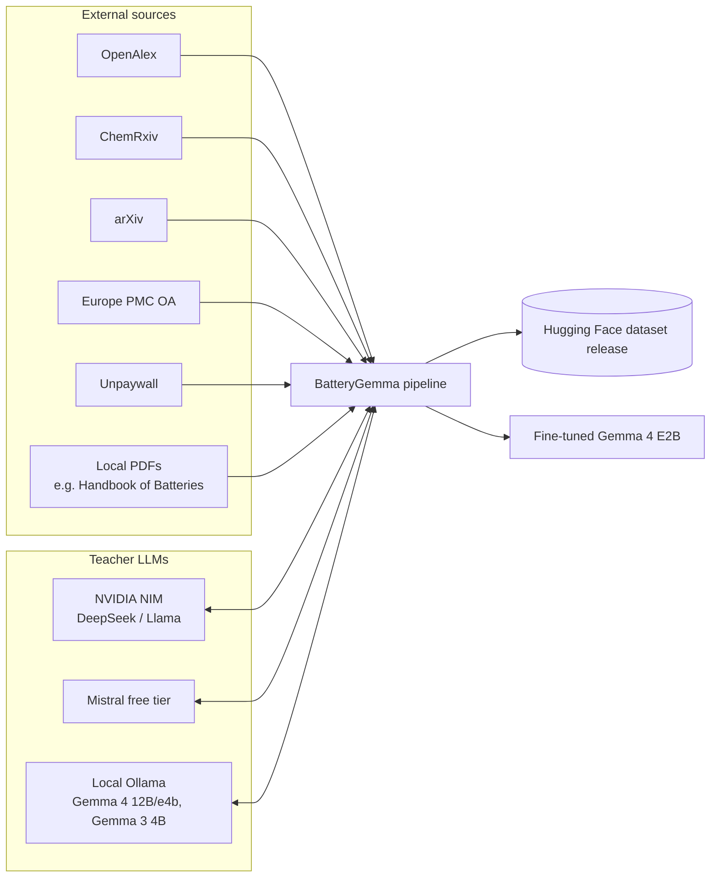
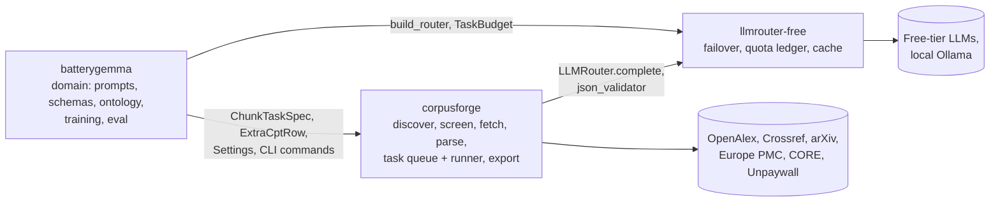

# 3. Context and Scope

### 3.1 Business context

### 3.1.1 The three packages

| Package | Owns | Knows nothing about |
|---|---|---|
| `llmrouter-free` | deployments/routes/rate limits, retries, response cache, `llm_calls` ledger, call metrics, structured-output helpers, `num_ctx` sizing arithmetic | corpora, papers, batteries |
| `corpusforge` | documents/files/chunks/`gen_tasks`/releases, all pipeline stages up to chunking, the batched chunk runner, CPT export + attribution, license gate, model-card scaffold, logs | what to extract, any domain |
| `batterygemma` | battery prompts and schemas, facts/claims/QA/negatives/DPO/ideation tables, ontology CPT rows, judge, SFT/DPO export, training, evaluation, the `bg` CLI | HTTP APIs, rate limits, PDF parsing |

### 3.2 Technical interfaces

| Interface | Protocol | Notes |
|---|---|---|
| OpenAlex, ChemRxiv, arXiv, Europe PMC, Unpaywall | HTTPS REST/JSON | polite crawling: contact-email User-Agent, per-host interval, retry/backoff (`corpusforge.sources.base.PoliteClient`) |
| LLM providers (OpenRouter, Groq, Cerebras, Mistral, ...) | OpenAI-compatible chat completions via LiteLLM | `llmrouter_free.LLMRouter` |
| Local Ollama | OpenAI-compatible chat completions via LiteLLM's `ollama_chat/` provider, `http://localhost:11434` | no API key; used as a rate-limit-proof fallback (ADR-006) |
| Unsloth / mlx-lm | in-process Python (no network) | `train/sft.py`, `eval/run_eval.py` |
| CLI | `bg <command>` (Typer) | the only user-facing interface; no web UI or API server |
