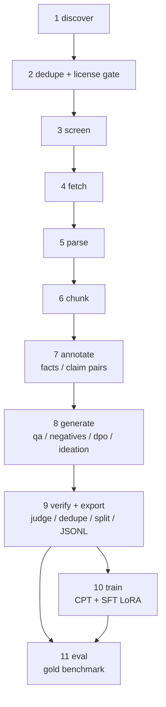
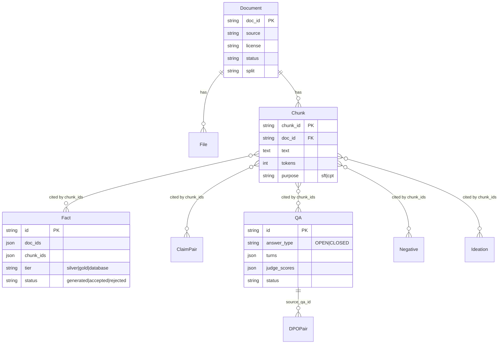

# 5. Building Block View

### 5.1 Level 1 — pipeline stages (whitebox of the overall system)



Stages 1-3 and parts of 4 are combined behind `bg discover`/`bg screen`/`bg fetch`; 5-6 behind `bg parse`; 7-9
are separate CLI command groups (`annotate`, `generate`, `judge`, `export`) so any one can be re-run
independently and resumed. `local` documents (user-supplied PDFs) enter directly at the "fetched" state via
`bg add-local`, skipping discover/screen/fetch.

### 5.2 Level 2 — module map

Three repositories, one dependency direction (`llmrouter-free` <- `corpusforge` <- `batterygemma`). Modules that moved
out of this repository are listed with their new home; their own documentation lives there
([llmrouter-free](https://github.com/fredbuildsai/llmrouter-free/tree/main/docs/architecture),
[corpusforge](https://github.com/fredbuildsai/corpusforge/tree/main/docs/architecture)).

```
batterygemma  (this repository)
  src/batterygemma/
    cli.py                 Typer entry point (`bg`). Registers corpusforge's pipeline commands unchanged
                            (discover, screen, fetch, images, add-local, parse, fetch-failures, pipeline-failures,
                            blacklist*, and the `logs` group) next to its own: init, stats, annotate, generate,
                            judge, export, db (init, adopt-split), llm, train, eval. Also the license-gate
                            orchestration (`_check_license_before_training`, `_materialize_run_folder`,
                            `_retrain_clean`) - interactive-prompt logic, deliberately kept in the CLI layer.
    settings.py             `Settings(corpusforge.Settings)` with the BG_ prefix; `get_settings()` installs it into
                            corpusforge (`set_settings`) so the embedded pipeline uses the same database/directories.
                            PACKAGE_ROOT (package assets) vs PROJECT_ROOT (cwd) - ADR-012.
    templates/              bundled default config YAMLs `bg init` copies into a fresh project's configs/
    migrations/             Alembic history for the battery tables only (own version table
                            `batterygemma_alembic_version`; baseline 0001)

    db/
      models.py             battery tables on batterygemma's OWN declarative base: Material, Fact, Comparison,
                            ClaimPair, QA, Ideation, Negative, DPOPair. No foreign keys into corpusforge tables -
                            rows point at corpus rows by string id (`doc_ids`, `chunk_ids`).
      session.py            get_engine()/get_session() (install settings first) / init_db() / migrate() - runs the
                            corpusforge migrations, the battery migrations, then the router-ledger create_all
      adopt.py              `bg db adopt-split`: adopt a pre-split database without touching its data (ADR-014)

    annotate/               stage 7 - domain half only: facts.py, claim_pairs.py = prompt + schema + row builder,
                            bundled as `FACTS_SPEC` / `CLAIMS_SPEC` (corpusforge.runner.ChunkTaskSpec)
    generate/               stage 8 - qa, negatives, dpo, ideation (per-chunk code; not yet on the runner)
    verify/judge.py         stage 9 - cross-family LLM judge
    ontology/               EMMO/BattINFO harness + lithium CPT definition rows
    export/
      unsloth_jsonl.py      SFT/DPO export; CPT delegates to corpusforge.export_cpt(extra_rows=ontology rows)
      model_card.py         BATTERY_MODEL_CARD (tags, intended use, limitations) for corpusforge's card builder
    train/                  stage 10 - environment.py, data.py, sft.py, telemetry.py
    eval/                   stage 11 - build_gold.py, run_eval.py, metrics.py
    llm/
      schemas.py            pydantic output schemas for every battery LLM JSON contract
      context_budget.py     the battery task registry (`TaskBudget`s from the real prompts) for num_ctx sizing

corpusforge  (github.com/fredbuildsai/corpusforge)
    models.py (Document, File, Chunk, GenTask, Release) · settings.py · db/session.py · migrations/ · logs.py
    sources/ (openalex, crossref, arxiv, local, store, PoliteClient) · screen/ (license, screening)
    fetch.py · images.py · parse/ (jats, pdf_docling, clean, chunk, pipeline)
    annotate/ (tasks, grounding) · runner.py (ChunkTaskSpec, run_batch, run_backlog) · pipeline_failures.py
    verify/ (split, dedupe) · export/ (corpus: export_cpt + AttributionManifest, licensing, hf_release) · cli.py

llmrouter-free  (github.com/fredbuildsai/llmrouter-free)
    router.py (LLMRouter) · store.py (llm_calls ledger, llm_call_metrics) · validation.py · context_budget.py
    config.py · cli.py
```

The annotate stages illustrate the split: `bg annotate facts` builds `FACTS_SPEC` (this repository: prompt, schema,
`persist_facts`) and hands it to `corpusforge.runner.run_backlog` (batching, `gen_tasks` bookkeeping, retry, back-off,
concurrency), which calls `llmrouter_free.LLMRouter.complete` (failover, cache, quota).

### 5.3 Data model (entity overview)



`Fact`, `Comparison`, `ClaimPair`, `QA`, `Ideation`, `Negative`, `DPOPair` all share two mixins:
**`ProvenanceMixin`** (`doc_ids`, `chunk_ids`, `license`, `split`, `generator_model`, `judge_scores`, `tier`,
`status`, `reject_reason`, `human_checked`) and, for the derived-layer tables, **`StratifiedMixin`**
(`task_format`, `polarity`, `question_type`, `component`, `chemistry`, `grounding`) — the labels the balancing
planner and export filters key off.

`Chunk.doc_id` is a real foreign key to `Document`, but every annotation/generation row stores `doc_ids`/
`chunk_ids` as JSON lists rather than foreign keys, because several row types (multi-doc synthesis Q&A,
ideation) are grounded in more than one chunk or document at once.
