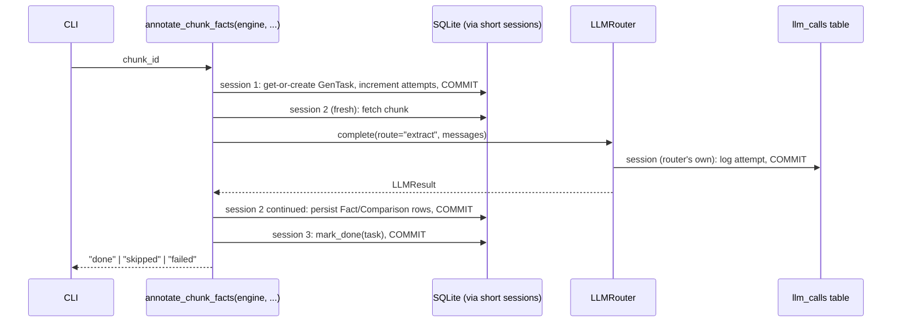
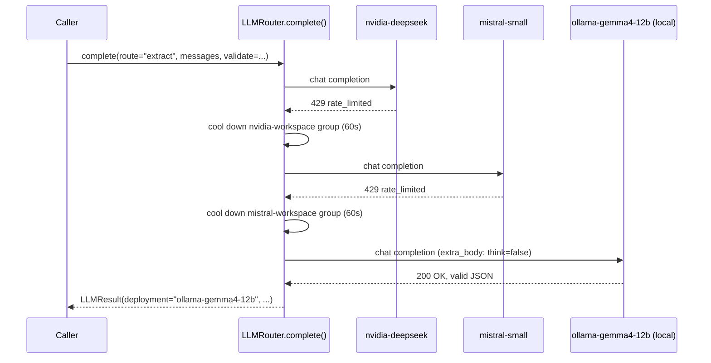
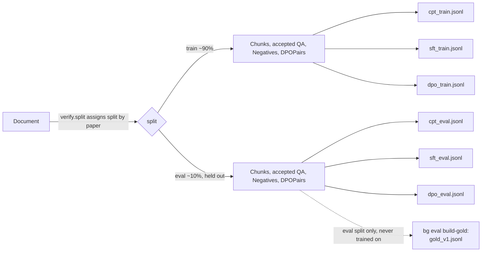

# 6. Runtime View

### 6.1 Scenario: resumable chunk annotation (the SQLite-deadlock-avoidance pattern)

This is the most consequential runtime pattern in the codebase (see ADR-003). Every `annotate_chunk_*` /
`generate_*` / `judge_one_*` function follows the same three-phase shape, taking an `Engine` rather than a
`Session` so it can open and close short-lived sessions around the one long-running step (the LLM call):

No session is ever left open with pending writes while the LLM call is in flight — the router logs to
`llm_calls` via its *own* independent session concurrently, and two overlapping SQLite writers on the same
file without this discipline deadlock rather than queue (confirmed by reproduction before the fix).

### 6.2 Scenario: teacher-LLM call with failover

If every deployment is only *temporarily* blocked, the router sleeps in bounded increments up to
`max_wait_seconds` (default 120s) before giving up with `AllDeploymentsExhausted`; a deployment that returns
an auth or "not in your tier" error is disabled outright rather than retried.

### 6.3 Scenario: export and train/eval split integrity

Every exported row's split is inherited from its source `Document.split`, never assigned independently — this
is what prevents one paper's content from leaking across train/eval, and it is also why the stage 11 gold
benchmark (`eval/build_gold.py`) only draws from `split == "eval"` documents: it is drawing from the same
papers already excluded from training, not a separate mechanism.
