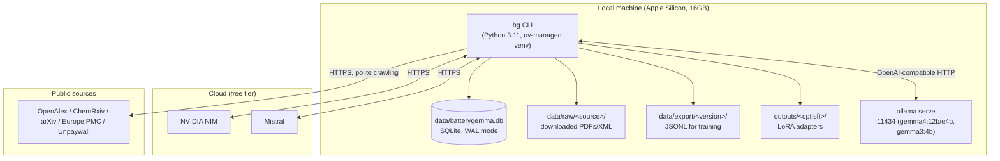
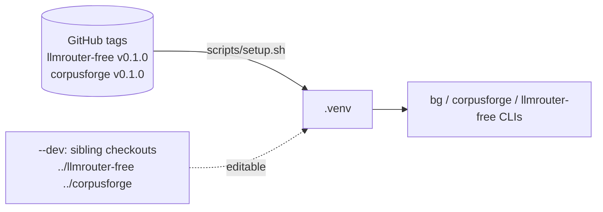

# 7. Deployment View

There is exactly one deployment environment: the developer's own Apple Silicon Mac.

No containerization, no orchestrator, no CD step — `uv run bg <command>` is the entire runtime.

**Installing.** `scripts/setup.sh` is the one-command setup: it checks Python (3.11/3.12) and git, installs `uv` if
missing, creates `.venv`, installs `llmrouter-free` and `corpusforge` from their GitHub tags and batterygemma
editable, then runs `bg init` and `bg db init`. `--dev` clones the two packages next to this repository and installs all
three editable (for working across repositories); `--with-train` adds the Unsloth extra; `--no-parse` skips the heavy
Docling dependency. Every documented command is exercised by tests via `--dry-run` (see `tests/test_setup_script.py`).

CI: each repository has a GitHub Actions workflow (pytest + ruff on Python 3.11 and 3.12). batterygemma's CI installs the
two packages from their GitHub tags, which also verifies the documented install path continuously.
Long stages are launched as background shell scripts (`scripts/*.sh`) writing timestamped logs under
`data/logs/`, watched interactively.
