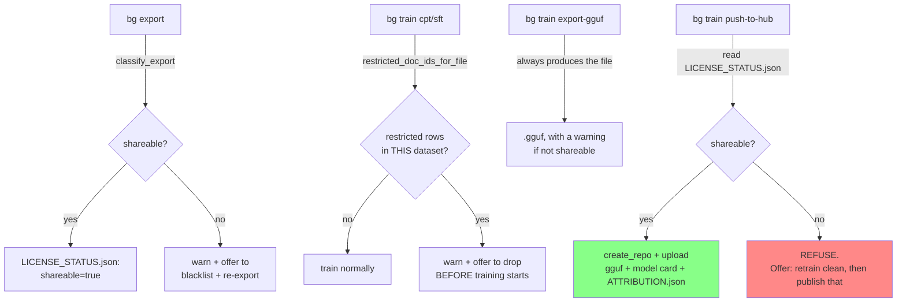

# The license gate: attribution, blacklisting, and the publish block

## The pain point

This project's whole premise is a public Hugging Face release. That means every scrap of training text needs
a license that actually permits redistribution — and the pipeline has *two* independent ways a
non-redistributable document can end up in the training set anyway:

1. **The automated pipeline gets it wrong** — a source API misreports a license, or a rare edge case in
   `corpusforge.screen.license`'s normalization slips through.
2. **A document bypasses the pipeline entirely** — this project's own database had exactly this: two
   commercial, copyrighted books (*Handbook of Batteries, 3rd Edition* and *Physical Chemistry of
   Polyelectrolytes*) added directly via `bg add-local`, which accepts any local PDF regardless of license
   for personal research use, and which therefore never passed through `corpusforge.screen.license`'s allow/flag/deny
   gate at all.

Both books had already contributed thousands of chunks, Q&A pairs, and DPO examples to the exported training
data by the time this was caught — found not by inspection, but because the **attribution manifest** (below)
made it visible in a single `LICENSE_STATUS.json` read. Without that manifest, there would have been no way
to know, short of manually re-checking every one of ~500 source documents against their license.

**A second, independent bug was found in the same pass**: `bg blacklist` (an older feature, for documents
that fail pipeline stages repeatedly) explicitly says it "does not touch or delete anything already
generated" — but the export functions never checked `Document.blacklisted` at all, meaning a document
blacklisted for *any* reason (not just copyright) still leaked its already-generated content into every
export. Both bugs are fixed by the same change: `export_cpt`/`export_sft`/`export_dpo` now always exclude
blacklisted documents, regardless of why they were blacklisted.

---

## Design: three checkpoints, one hard gate



Three places *warn and offer to fix it*; **exactly one place actually refuses**: `bg train push-to-hub`.
Everything before that is advisory, because training on restricted material for your own local/private use
is legitimate — it's *redistributing* it that isn't. See
[ADR-010](architecture/09-architecture-decisions.md#adr-010-license-gate--the-hard-block-is-at-publish-not-at-gguf-export) for why the
gate specifically sits at the publish step and nowhere earlier, including an explicit design correction made
mid-session (an earlier version of this gate blocked GGUF creation itself, which was the wrong place).

---

## The attribution manifest

Every export writes a companion file per JSONL: `cpt_train.jsonl` → `cpt_train.attribution.json`. It maps
each source document (keyed by DOI, or `doc_id` when no DOI exists — e.g. some theses/OSTI records) to which
row indices came from it:

```json
{
  "10.1002/adfm.202010046": {
    "doc_id": "openalex:W3135527169",
    "license": "CC-BY",
    "title": "Nido‑Hydroborate‑Based Electrolytes for All‑Solid‑State Lithium Batteries",
    "chunks": [10158, 10159, 10160, "..."]
  }
}
```

This is the format the user explicitly asked for: `{doi: {"chunks": [row indices...]}}`. It's built once, in
`export/unsloth_jsonl.py::AttributionManifest`, and reused for three different jobs downstream:

1. **Classification** (`corpusforge.export.licensing::classify_export`) — evaluate every source's license against the
   same allow/flag lists ingestion uses (`configs/sources.yaml`), so a document's public-release status is
   judged identically whether it's being screened on the way in or checked on the way out.
2. **Filtering** (`restricted_row_indices_for_file` + `write_filtered_jsonl`) — turn "these doc_ids are
   restricted" directly into "drop these exact line numbers," without re-deriving anything from the database.
3. **The published `ATTRIBUTION.json`** — the same manifest, unioned across every file a given model was
   trained on, shipped alongside the model on Hugging Face so downstream users can verify licensing
   themselves rather than taking the model card's word for it.

---

## Walking through a real example

This is what actually happened in this project, not a hypothetical:

```bash
$ bg export --version v0.1

cpt: {'train': 13443, 'eval': 1181}
...
exported to data/export/v0.1

WARNING: 1 source document(s) in this export are NOT safely redistributable
(missing/unclear license, or a license outside ['CC0', 'CC-BY', 'public-domain'] / flagged ['CC-BY-SA']):
  [rejected] local:a1acf975283de32a (all-rights-reserved): Physical Chemistry of Polyelectrolytes
Consequence: a model or dataset trained on this export must NOT be uploaded to Hugging Face or any
public platform while these are included - `bg train push-to-hub` will refuse to publish a GGUF built
from it.
Blacklist these documents and re-export a clean, shareable version now? [y/N]: y

cpt: {'train': 11375, 'eval': 1181}
...
re-exported without restricted documents -> now safe for public release. Saved locally at data/export/v0.1.
```

Notice the CPT row count *already* dropped from 13,443 to 12,081 on the very first export call, before the
prompt even appeared — that's the second bug from above: `local:5fd7af013a936cc1` (*Handbook of Batteries*)
had already been blacklisted for an unrelated reason (42 failed pipeline tasks, via the pre-existing
`bg blacklist` command), and the newly-added `not doc.blacklisted` check in the export functions caught it
immediately, for free. Only the second book — never blacklisted for any reason before — triggered the actual
license-gate prompt above.

---

## Self-verification: why `LICENSE_STATUS.json` exists everywhere

Every export directory and every training run folder gets one:

```json
{
  "shareable": true,
  "restricted_doc_ids": [],
  "by_file": {
    "cpt_train.jsonl": {"shareable": true, "restricted_doc_ids": [], "restricted_rows": 0}
  },
  "training_provenance": {"stage": "cpt", "config": "train_cpt", "dataset": "outputs/cpt/dataset.jsonl"}
}
```

This is the single source of truth `bg train push-to-hub` checks — it never re-derives shareability from
scratch at publish time, it reads what was already decided (and recorded) at export/train time. Three
consequences of that design:

- **No `LICENSE_STATUS.json` → hard refusal**, not "assume it's fine." An adapter trained before this feature
  existed, or with provenance somehow lost, cannot be published until retrained under the current gate. This
  is deliberate: an *absence* of a safety record is treated the same as a *known-bad* one, never as
  known-good.
- **`training_provenance`** (`stage`, `config`, `dataset`, `from_adapter`) is exactly what a blocked publish
  needs to *automatically* retrain clean and re-export — see the sequence diagram in
  [training.md](training.md#publishing-to-hugging-face).
- Because [every run folder is self-contained](training.md#self-contained-run-folders), the `dataset` path in
  `training_provenance` always points at a local copy inside that run's own folder, not the shared
  `data/export/` tree — so retraining clean never depends on state outside the run folder that could have
  since changed.

---

## Automation with `--yes`

`bg export`, `bg train cpt|sft`, and `bg train push-to-hub` all accept `--yes`/`-y`. At every prompt, `--yes`
always takes the **compliant** branch — drop the restricted material and continue — never the "keep
everything, skip the check" branch:

| Command | Without `--yes` | With `--yes` |
|---|---|---|
| `bg export` | Prompts to blacklist + re-export | Auto-blacklists + re-exports |
| `bg train cpt\|sft` | Prompts to drop restricted rows before training starts | Auto-drops before training starts |
| `bg train push-to-hub` | Prompts to retrain clean, then prompts again before the actual upload | Auto-retrains clean, still uploads (there's no further check to skip — reaching this point already means the data is clean) |

A command with **no** restricted material found never prompts at all, `--yes` or not — automation only
changes behavior at the exact point a human would otherwise need to decide something.

One command intentionally has **no** `--yes` behavior: `bg train export-gguf` never blocks and never prompts,
regardless of shareability, so there's nothing for a flag to automate there.

---

## Command reference

| Command | License-gate behavior |
|---|---|
| `bg export --version vX.Y [--yes]` | Warns + offers to blacklist and re-export clean if any source isn't open-licensed. |
| `bg train cpt\|sft <dataset> [--yes]` | Warns + offers to drop restricted rows *before* training starts. |
| `bg train export-gguf <adapter_dir>` | Never blocks; warns if the adapter isn't shareable. |
| `bg train push-to-hub <gguf_dir> --repo-id ... [--yes]` | **Hard refusal** if not shareable; offers to retrain clean automatically, then publish. |
| `bg blacklist` / `bg blacklist-list` / `bg blacklist-remove` | The underlying mechanism the license gate uses to permanently exclude a document from every future export — also used independently for documents that fail pipeline stages repeatedly. |
