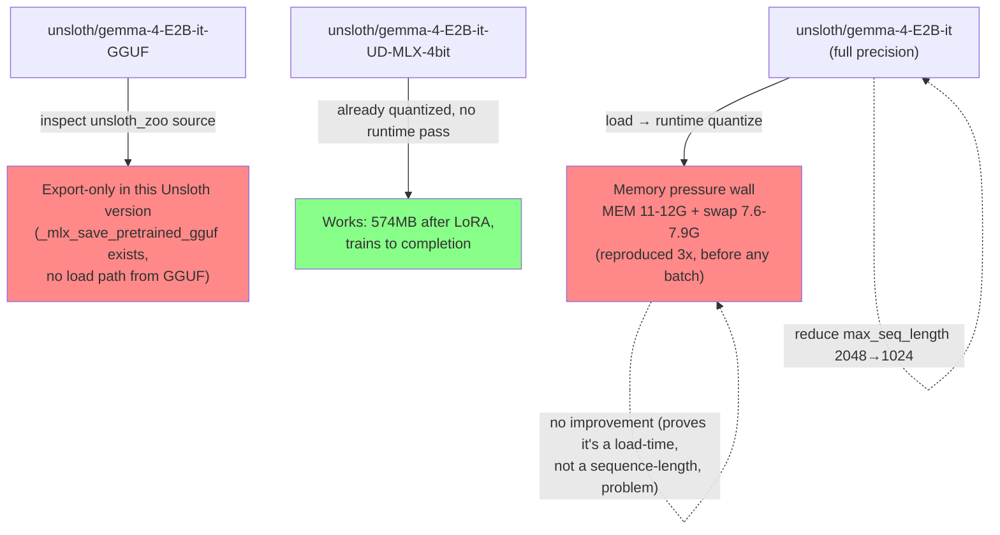
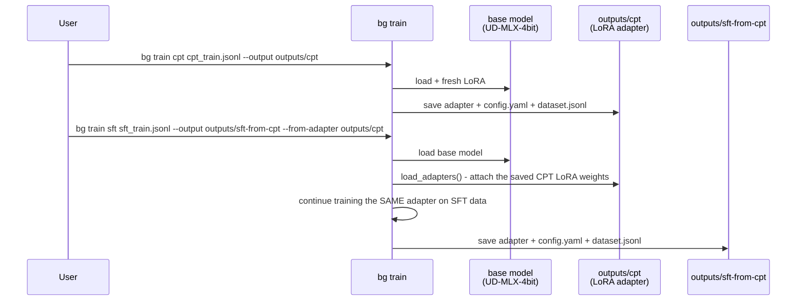
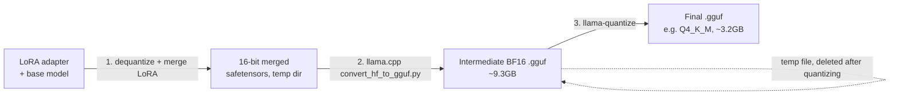
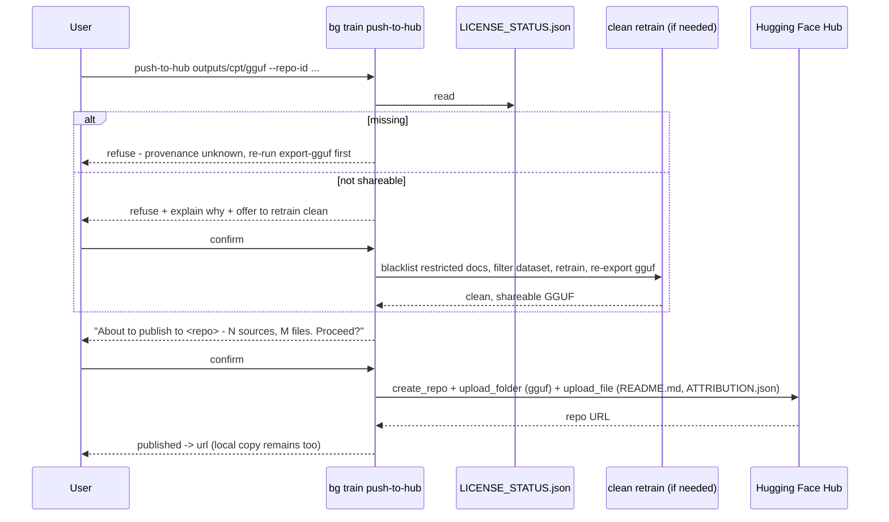

# Training, GGUF export, and publishing

This is the practical guide to stage 10 (train) and everything downstream of it: turning an exported
JSONL dataset into a LoRA adapter, then a GGUF file you can run locally, then (optionally) a model
published to Hugging Face. For *why* the pipeline is shaped this way, see the referenced ADRs in
[architecture.md](architecture.md#9-architecture-decisions). For the license-gate mechanics that show up
throughout this doc, see [licensing.md](licensing.md).

---

## The pain point

Fine-tuning Gemma 4 E2B on a 16GB Apple Silicon laptop, with no CUDA, turned out to be a much narrower path
than the docs suggested. Unsloth's own documentation is CUDA-first; its Apple Silicon ("MLX") support is
real but under-documented, and following the obvious CUDA-style recipe **silently degrades into a slow,
memory-thrashing failure** rather than a clean error. Getting from "pip install unsloth" to "a training run
that actually completes" took several real, reproduced failures — this doc exists so nobody (including
future-you) has to rediscover them.

---

## Training on Apple Silicon: what actually works

### The model matters more than the code

Three model variants were tried, in this order, each one a real live attempt:

| Model | Result |
|---|---|
| `mlx-community/gemma-4-e2b-it-4bit` | Community MLX quant — worked, but superseded once Unsloth's own quant was found. |
| `unsloth/gemma-4-E2B-it` (full precision) | **Hung 3 times**, reproducibly, at the identical point in loading — before a single training batch was processed. `top` showed the process in state `stuck`, resident memory 11-12GB plus 7.6-7.9GB compressed (≈19GB total) on a 16GB machine: a hard memory-pressure wall, not a slow-but-working run. Confirmed independent of `max_seq_length` (reducing 2048→1024 made no difference — the spike happens during model load/runtime-quantization, before any sequence is even tokenized). |
| `unsloth/gemma-4-E2B-it-GGUF` | Looked like the fix (GGUF *is* 4-bit) — but reading the installed `unsloth_zoo` source directly showed this Unsloth version's MLX backend only **exports** to GGUF (`_mlx_save_pretrained_gguf`), it has no load path from GGUF for training. Dead end, confirmed by source inspection, not by another failed run. |
| `unsloth/gemma-4-E2B-it-UD-MLX-4bit` | **This is the one.** Unsloth's own MLX-native, pre-quantized ("UD" = Unsloth Dynamic) checkpoint. No runtime quantization pass at load — confirmed live by the log line `'unsloth/gemma-4-E2B-it-UD-MLX-4bit' is already quantized — using existing compatible MLX quantization`. LoRA-applied memory footprint: **574MB**, versus multi-gigabyte for the full-precision path at the same point. |



**Takeaway**: on this backend, "4-bit" is not one thing. A model repo that *becomes* 4-bit at load time
(via runtime quantization) is a completely different memory profile from one that *is already* 4-bit on
disk. Always check which kind a repo is before assuming "4-bit" means "will fit."

### `FastModel` vs `FastLanguageModel`: same thing here

If you've read Unsloth's CUDA-oriented examples, you'll see `FastLanguageModel.from_pretrained(...)`. On
this machine, that's not a different, CUDA-specific code path — reading `unsloth/__init__.py` directly shows
`FastLanguageModel = FastModel = FastTextModel`, all aliases for the same MLX-backed loader
(`FastMLXModel.from_pretrained` under the hood). There is no separate bitsandbytes/CUDA quantization path to
opt into on Apple Silicon; `load_in_4bit=True` is already the default and is a no-op on an already-quantized
repo. Passing the CUDA-style full-precision repo name here just reproduces the memory-hang problem above.

### `text_only`: why it exists, and why it's a config, not a constant

Gemma 4 E2B is natively multimodal. Loaded without any hint, this backend defaults to the vision-language
(mlx-vlm) path — which doesn't support `assistant_only_loss` at all, among other limitations. Since this
project has no vision use case *yet*, `text_only: true` in `configs/train_cpt.yaml`/`train_sft.yaml` forces
the plain-text `mlx-lm` path. It's a config key rather than a hardcoded `True` specifically so a future
multimodal experiment (training against a `bg export --include-images` dataset) is a one-line config change,
not a code change.

---

## Running a training stage

```bash
bg train cpt data/export/v0.1/cpt_train.jsonl
bg train sft data/export/v0.1/sft_train.jsonl
```

Both read their hyperparameters from `configs/train_cpt.yaml` / `configs/train_sft.yaml` (override with
`--config <name>` to use a different file). Useful flags:

| Flag | Purpose |
|---|---|
| `--output DIR` | Where the adapter (and everything else — see [self-contained run folders](#self-contained-run-folders) below) is saved. Default `outputs/cpt` / `outputs/sft`. |
| `--gguf` | Also merge and export a quantized GGUF file right after training, in the same process (avoids a second model load). |
| `--from-adapter DIR` | Continue training a *previous stage's* adapter instead of starting a fresh LoRA on the base model — this is how CPT → SFT chaining works (see below). |
| `--yes` / `-y` | Non-interactive: auto-confirm dropping any non-open-licensed rows the license gate finds (see [licensing.md](licensing.md)). Never skips the check itself, only the pause. |

### Why the PoC step counts are small

`configs/train_cpt.yaml` defaults to `max_steps: 30`, `train_sft.yaml` to `40`. This project's corpus has
13,443 CPT chunks; at `batch_size=1, grad_accum=8`, one full epoch is ~1,680 steps — so 30 steps is about
1.8% of a single pass, deliberately small. For a proof-of-concept, this is the right regime: memory and
step-time were measured live at 30 steps (see [the numbers](#what-to-expect-timing-and-memory) below) before
committing to anything longer, and CPT's loss curve (like any pretraining) drops fastest early and flattens
— see [ADR-009](architecture.md#adr-009-mlx-model-selection-through-three-real-failures) for the full
memory-hang story this default was chosen *around*. Push `max_steps` up once you've confirmed the small run
behaves as expected; going past one full epoch on a fixed corpus is where diminishing returns (and eventual
overfitting to specific chunks) start to matter, not before.

### What to expect: timing and memory

Measured live on a 16GB M1 Air, `unsloth/gemma-4-E2B-it-UD-MLX-4bit`, LoRA rank 16:

| Stage | Steps | Peak memory | Time |
|---|---|---|---|
| CPT | 30 | 6.0 → 7.4 GB (climbs slightly, plateaus) | ~23 min (1364s, ~45s/step) |
| SFT (from base) | 40 | similar range | proportional — see the linear-scaling table below |

Memory plateaus within the first few steps rather than growing unboundedly — running more steps costs time,
not more memory. Rough scaling (measured, not estimated): 30 steps ≈ 23 min ⇒ 100 steps ≈ 76 min ⇒ 150 steps
≈ 114 min.

---

## Chaining CPT → SFT



`--from-adapter` was built specifically **to compare CPT-only, SFT-only, and CPT+SFT side by side** — the
`load_or_apply_lora()` helper in `train/sft.py` either starts a fresh LoRA (default) or reloads a prior
stage's saved adapter config/weights via `mlx_lm.tuner.utils.load_adapters` and keeps training it, so each
combination lands in its own output directory for comparison.

### A known, currently-broken combination

Chaining SFT on top of a CPT adapter was tried live and **diverged to NaN loss by step 2**. The likely cause:
`load_adapters` (the `mlx_lm`-native loader used for `--from-adapter`) parameterizes LoRA scaling differently
than Unsloth's own `get_peft_model` (used for a fresh LoRA), and that mismatch combined with fp16 CCE loss
training pushed the optimizer out of range almost immediately. This is flagged here rather than silently
left for the next person to rediscover — **CPT-only and SFT-only (from base) both train cleanly**; CPT→SFT
chaining needs further numerical investigation before it's trustworthy. See
[Risks and Technical Debt](architecture.md#11-risks-and-technical-debt).

---

## Self-contained run folders

Every `bg train cpt|sft` run copies its **exact** resolved config and **exact** training dataset into its
own output directory:

```
outputs/cpt/
  adapters.safetensors       # the LoRA weights
  adapter_config.json
  config.yaml                # <- copy of configs/train_cpt.yaml AT THE TIME this run started
  dataset.jsonl               # <- copy of the exact training data (post license-filtering, if any)
  dataset.attribution.json    # <- copy of the matching attribution manifest
  LICENSE_STATUS.json         # <- shareability + enough provenance to retrain clean later
  gguf/                        # <- only if --gguf was passed
```

**Why**: without this, `outputs/cpt/config.yaml` would only exist implicitly as "whatever
`configs/train_cpt.yaml` happened to contain at the time" — a file that gets edited for the *next* run. Six
months later, there's no way to know what actually produced a given adapter. Copying the config and data in
makes every run folder **reproducible and portable** on its own: move it to another machine, and everything
needed to explain (or redo) that exact run travels with it. This is also what makes the license-gate's
retrain-clean flow (see [licensing.md](licensing.md)) self-contained — the filtered dataset it writes lands
inside the same run folder, not scattered across the shared `data/export/` tree.

---

## GGUF export

```bash
bg train export-gguf outputs/cpt
```

Merges the LoRA adapter into the base weights and produces a quantized `.gguf` file, usable directly with
Ollama, LM Studio, or any llama.cpp-based runtime.



### Why it dequantizes first (this always happens, MLX or not)

This surprises people: the base model is *already* 4-bit, so why does export briefly produce a 9GB
intermediate file? Two independent reasons force it, and they apply to **every** Unsloth GGUF export,
CUDA or MLX:

1. **LoRA merging needs full-precision arithmetic** — you can't cleanly add a LoRA weight delta onto
   already-quantized weights.
2. **llama.cpp's `convert_hf_to_gguf.py` only reads fp16/bf16/fp32 safetensors** — it has no concept of an
   MLX (or bitsandbytes) quantized input format.

So the sequence is always merge → 16-bit → convert → re-quantize, regardless of what quantization the
starting checkpoint had. Budget disk space accordingly: **peak usage during export is roughly 3x the final
file size** (temp merged model + intermediate BF16 GGUF + final quantized file, before the intermediate is
deleted). A first attempt on this project's machine failed at 49% through the BF16 write with only 23GB free
— clearing ~13GB of stale cached models (a since-superseded full-precision checkpoint and an earlier
community MLX quant) fixed it.

### GGUF creation is never blocked by licensing — publishing is

`bg train export-gguf` always produces the file, even from an adapter trained on non-open-licensed material,
and just prints a warning in that case. **Uploading** is the actual point of enforcement — see
[licensing.md](licensing.md#the-hard-gate-is-at-publish-time-not-at-export-gguf) for why the gate sits there
and not here.

---

## Trying it locally (Ollama)

```bash
cat > outputs/cpt/gguf/Modelfile <<'EOF'
FROM ./gemma-4-E2B-it-UD-MLX-4bit.Q4_K_M.gguf
EOF
ollama create batterygemma-cpt -f outputs/cpt/gguf/Modelfile
ollama run batterygemma-cpt "What happens to NMC811 cathodes when charged above 4.2V?"
```

Useful for a quick sanity check, and for comparing the fine-tuned model against the pre-existing base model
side by side (`ollama show <model>` reports parameter count and quantization — the fine-tuned, text-only
export is a real 4.6B parameters vs. the multimodal base's 5.1B, since the vision/audio towers were never
loaded in the first place).

---

## Publishing to Hugging Face

```bash
bg train push-to-hub outputs/cpt/gguf --repo-id you/batterygemma-cpt
```

This is the hard license gate (full details in [licensing.md](licensing.md)) plus the actual upload:
generates a model card (base model, LoRA details, training data summary, bias/risks/limitations, per
[Hugging Face's documented model-card sections](https://huggingface.co/docs/hub/model-cards)) and an
`ATTRIBUTION.json` (every source document's DOI, license, and row count), and uploads both alongside the
GGUF file via `huggingface_hub`.



Every step that changes something meaningful (dropping restricted material, or publishing) asks for
confirmation, and states in plain text what will happen and where the resulting file lives — except when
`--yes` is passed, which auto-confirms the *safe* branch (drop-and-continue) without ever skipping the
license check itself. See [licensing.md](licensing.md#automation-with---yes) for exactly what `--yes` does
and doesn't do at each of the three gated commands.

---

## Command reference

| Command | What it does |
|---|---|
| `bg train status` | Installs Unsloth if missing; reports package/accelerator versions. |
| `bg train cpt <dataset> [--output DIR] [--config NAME] [--gguf] [--from-adapter DIR] [--yes]` | Continued pretraining. |
| `bg train sft <dataset> [--output DIR] [--config NAME] [--gguf] [--from-adapter DIR] [--yes]` | Supervised fine-tuning. |
| `bg train export-gguf <adapter_dir> [--output DIR] [--config NAME] [--quantization TYPE]` | Merge + quantize to GGUF. Never blocked by licensing. |
| `bg train push-to-hub <gguf_dir> --repo-id OWNER/NAME [--private/--no-private] [--yes]` | The license-gated publish step. |
